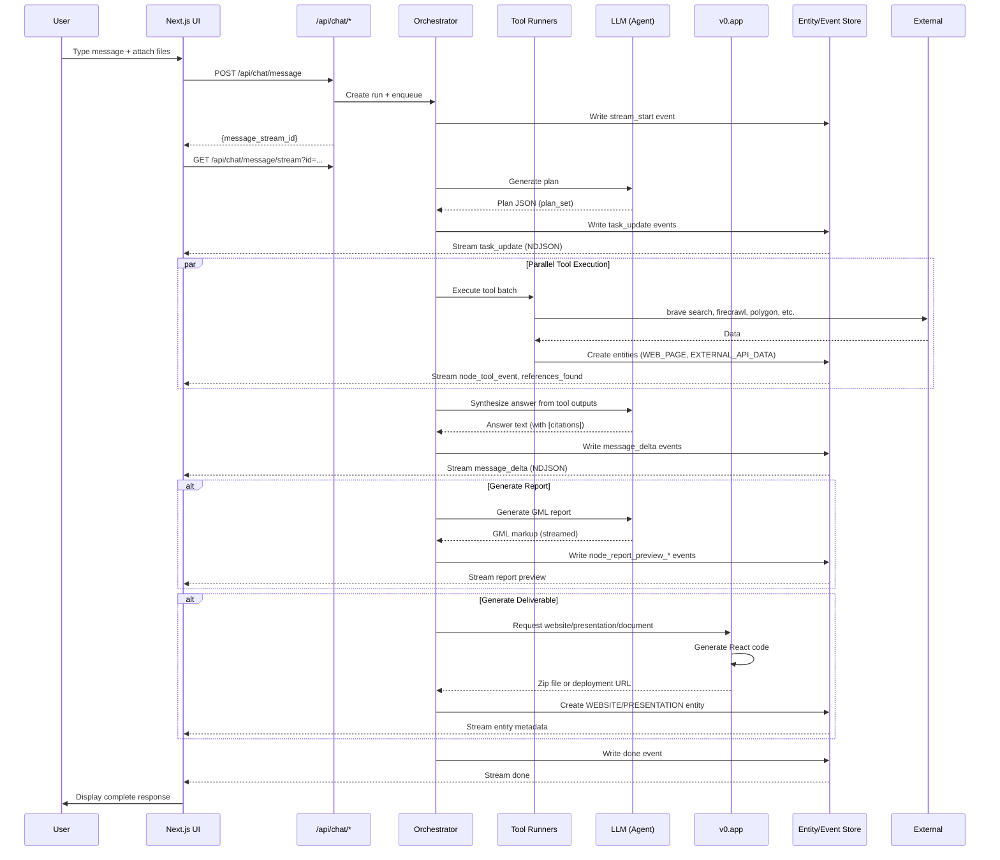

# SuperAgent System Architecture
## Comprehensive Reverse-Engineered Analysis

**Date**: 2026-02-16
**Analyst**: Claude Opus 4.6
**Source Materials**: Production bundles, chat exports, v0.app reports, streaming protocol analysis
**Confidence Legend**:
- **CONFIRMED** = Multiple independent sources
- **INFERRED** = Single source + logical deduction
- **SPECULATED** = Architectural pattern matching

---

## Executive Summary

Airtable SuperAgent is a multi-agent orchestration platform that generates professional research reports with interactive deliverables. The system uses:

1. **Next.js frontend** with custom GML (Gradient Markup Language) rendering
2. **NDJSON streaming protocol** over HTTP for real-time agent updates
3. **Durable execution runtime** with replay/time-travel capabilities
4. **Multi-agent parallelization** with plan/node/tool execution model
5. **v0.app integration** for exporting standalone React applications
6. **Entity-first architecture** for citations, artifacts, and tool outputs

The platform bridges two rendering paths:
- **Chat UI**: Real-time GML streaming with healing/validation
- **Export UI**: v0.app-generated React applications with Recharts/D3

---

## Table of Contents

1. [Frontend Architecture](#1-frontend-architecture)
2. [Route Structure](#2-route-structure)
3. [Component Architecture](#3-component-architecture)
4. [State Management](#4-state-management)
5. [API Surface](#5-api-surface)
6. [Streaming Protocol](#6-streaming-protocol)
7. [Agent Orchestration](#7-agent-orchestration)
8. [Data Flow](#8-data-flow)
9. [Authentication & Session](#9-authentication--session)
10. [Entity Model](#10-entity-model)
11. [GML Rendering System](#11-gml-rendering-system)
12. [Report Generation Pipeline](#12-report-generation-pipeline)
13. [Infrastructure & Services](#13-infrastructure--services)
14. [External Integrations](#14-external-integrations)

---

## 1. Frontend Architecture

### 1.1 Technology Stack (CONFIRMED)

**Core Framework**
- **Next.js** (production build manifest confirms routing structure)
- **React 18+** (streaming, suspense, server components)
- **TypeScript** (evidenced by .tsx extensions in v0.app exports)

**Styling**
- **Tailwind CSS v4** (CSS-first configuration, no tailwind.config.js)
- **CSS Custom Properties** (277 variables across theme system)
- **Container Queries** (`@3xl:` breakpoint for responsive layouts)

**UI Components**
- **shadcn/ui** (57-component bundle in v0.app exports)
- **Radix UI primitives** (Progress, Dialog, Popover, etc.)
- **Class Variance Authority (CVA)** for component variants
- **Framer Motion** for animations

**Data Visualization**
- **Plotly.js** (chat UI, 10 chart types with Zod validation)
- **Recharts** (v0.app exports, bar/line/area/pie charts)
- **D3.js** (v0.app exports for force graphs, custom SVG layouts)
- **react-simple-maps** (v0.app exports for geographic visualizations)

**Validation & Type Safety**
- **Zod** (stream event validation, chart schema validation)
- **TypeScript strict mode** (v0.app exports use strict typing)

### 1.2 Custom Design System (CONFIRMED)

**Proprietary Font**
- **AT Season Sans / Seasons Sans** (12 weights: 100-900 plus 440/550/580/650)
- **Geist Mono** for code/monospace
- Content-hash filenames served from Vercel CDN

**Color System**
- **OKLCH + HSLA dual system** with alpha-neutral scale
- **6-layer shadow system** for depth hierarchy
- **Dark mode** via `.dark` class toggle

**Chart Palette** (HSLA)
```javascript
[
  "hsla(186, 60%, 20%, 1)",  // Teal dark
  "hsla(186, 54%, 36%, 1)",  // Teal medium-dark
  "hsla(186, 44%, 43%, 1)",  // Teal medium
  "hsla(186, 44%, 58%, 1)",  // Teal medium-light
  "hsla(186, 53%, 65%, 1)",  // Teal light
  "hsla(185, 50%, 80%, 1)",  // Teal lightest
]
```

---

## 2. Route Structure

### 2.1 Application Routes (CONFIRMED)

From `_buildManifest.js`:

| Route | Purpose | Bundle | Confidence |
|-------|---------|--------|-----------|
| `/` | Landing page | `index-f59b4b01610b5799.js` | CONFIRMED |
| `/chat/[chatId]` | Primary chat interface | `[chatId]-058fa92e7cc73e56.js` | CONFIRMED |
| `/tasks` | Task list view | `tasks-b8b75757ac6ae843.js` | CONFIRMED |
| `/tasks/[taskRunId]` | Individual task/run detail | `tasks/[taskRunId]-cd102d04202ccb82.js` | CONFIRMED |
| `/prompt` | Prompt template/editor | `prompt-548ae916d9c07508.js` | CONFIRMED |
| `/report/preview/[artifactId]` | Report preview viewer | `report/preview/[artifactId]-f7fd95b89c790024.js` | CONFIRMED |
| `/website/[storedEntityId]` | Website deliverable viewer | `website/[storedEntityId]-9f7c72d6ed616bdb.js` | CONFIRMED |
| `/content-library` | Curated content index | `content-library-a811e2624d7528c0.js` | CONFIRMED |
| `/content-library/[categorySlug]` | Content category view | `content-library/[categorySlug]-03122e3e446f4972.js` | CONFIRMED |
| `/library-reports/[reportId]` | Report library detail | `library-reports/[reportId]-0c733c4843ce3f23.js` | CONFIRMED |
| `/workspace/[selectedWorkspaceId]/landing` | Workspace landing page | `workspace/[selectedWorkspaceId]/landing-00f33e9346c62673.js` | CONFIRMED |
| `/share/[slug]` | Public share link | `share/[slug]-d2142414d49ea391.js` | CONFIRMED |
| `/account` | Account settings | `account-636c0596334161e2.js` | CONFIRMED |
| `/admin` | Admin panel | `admin-e596f73d937b8002.js` | CONFIRMED |

### 2.2 Route Purposes (INFERRED)

**Core Product Flow**
1. User lands on `/` → sees marketing/onboarding
2. Navigates to workspace landing → `/workspace/[id]/landing`
3. Creates new chat → redirected to `/chat/[chatId]`
4. Chat streams real-time updates
5. Completed reports → `/report/preview/[artifactId]`
6. Website deliverables → `/website/[storedEntityId]`

**Support Routes**
- `/tasks/*` — View running/completed agent tasks
- `/prompt` — Manage prompt templates (SPECULATED: admin/power-user feature)
- `/content-library` — Pre-built templates and examples
- `/library-reports` — Saved report gallery
- `/share/*` — Public sharing without auth
- `/account` — User settings, billing, preferences
- `/admin` — Platform administration

---

## 3. Component Architecture

### 3.1 Top-Level Page Components (CONFIRMED)

**Chat Page** (`/chat/[chatId]`)
- Message list container with virtual scrolling
- Chat input composer with deliverable type selector
- Info panel (Sources | Files | Activity tabs)
- Full-screen generation overlay with progress
- Subagent task queue (card-based UI)

**Task Management** (`/tasks`)
- Task list with filtering
- Status indicators (loading | success | error)
- Task detail modal/view

**Report Preview** (`/report/preview/[artifactId]`)
- GML renderer for chat-generated reports
- Download/share actions
- Citation viewer panel

**Website Viewer** (`/website/[storedEntityId]`)
- Iframe embed for deployed site
- Deploy status indicator
- URL management

### 3.2 Shared Components (CONFIRMED)

**Navigation**
- Top navigation bar with workspace selector
- Sidebar navigation (collapsed/expanded states)
- Breadcrumbs for deep navigation

**Layout**
- Container components (max-width constraints)
- Responsive grid system
- Sticky headers/footers

**Overlays**
- Modal dialogs (Radix Dialog)
- Slide-out panels (Framer Motion slide-in)
- Toast notifications (Sonner)

### 3.3 Chat Page Component Hierarchy (INFERRED)

```
ChatPage
├─ ChatHeader
│  ├─ WorkspaceSelector
│  ├─ ChatTitle
│  └─ InfoPanelToggle
├─ MessageList
│  ├─ MessageGroup (per agent turn)
│  │  ├─ UserMessage
│  │  │  └─ FileAttachments
│  │  └─ AIMessage
│  │     ├─ GMLRenderer
│  │     │  ├─ GMLRow (layout)
│  │     │  ├─ GMLPrimaryColumn
│  │     │  │  ├─ ChartContainer (Plotly)
│  │     │  │  ├─ GradientInsightBox
│  │     │  │  └─ InlineCitation
│  │     │  └─ GMLSidebarColumn
│  │     │     ├─ InfoBlockMetric
│  │     │     ├─ InfoBlockEvent
│  │     │     └─ InfoBlockStockTicker
│  │     ├─ SourcePills (clickable citations)
│  │     └─ ActionBar
│  │        ├─ CopyButton
│  │        ├─ ShareButton
│  │        └─ RegenerateButton
│  └─ TypingIndicator
├─ ChatInput
│  ├─ TextArea (auto-resize)
│  ├─ FileUploadButton
│  ├─ DeliverableTypeSelector
│  │  ├─ Standard mode
│  │  ├─ Enhanced Report mode
│  │  └─ Deliverable type (Website/Presentation/Document/Code)
│  └─ SendButton
├─ InfoPanel (slide-out)
│  ├─ TabBar (Sources | Files | Activity)
│  ├─ SourcesTab
│  │  └─ EntityList (with metadata)
│  ├─ FilesTab
│  │  └─ FileList (uploaded documents)
│  └─ ActivityTab
│     ├─ ReasoningSection (expandable)
│     ├─ WorkstreamChips (parallel tasks)
│     └─ ToolExecutionLog
└─ GenerationOverlay (full-screen modal)
   ├─ ProgressBar (continuous across substeps)
   ├─ PrimaryStatus ("Generating output...")
   ├─ SecondaryStatus ("Polishing typography...")
   └─ SubagentTaskQueue
      └─ TaskCard[] (ID, title, duration, status, progress)
```

### 3.4 GML Component Registry (CONFIRMED)

From `1889-c64cad4788e7b7b9.js`:

```typescript
const GML_COMPONENTS = {
  'gml-row': GMLRow,
  'gml-primarycolumn': GMLPrimaryColumn,
  'gml-sidebarcolumn': GMLSidebarColumn,
  'gml-halfcolumn': GMLHalfColumn,
  'gml-chartcontainer': ChartContainer,
  'gml-gradientinsightbox': GradientInsightBox,
  'gml-infoblockmetric': InfoBlockMetric,
  'gml-infoblockevent': InfoBlockEvent,
  'gml-infoblockstockticker': InfoBlockStockTicker,
  'gml-inlinecitation': InlineCitation,
  'gml-blockquote': BlockQuote,
  'gml-downloadfile': DownloadFile,
  'gml-viewreport': ViewReport,
  'gml-viewwebsite': ViewWebsite,
  'gml-viewpresentation': ViewPresentation,
  'gml-viewgenerateddocument': ViewGeneratedDocument,
  'gml-components': ComponentsRegistry,
  'gml-header-elt': HeaderElement,
}
```

---

## 4. State Management

### 4.1 Client-Side State (INFERRED)

**React State Patterns**
- `useState` for local component state
- `useContext` for theme, workspace, user session
- `useMemo`/`useCallback` for performance optimization
- `useEffect` for side effects (fetch, subscriptions)

**Custom Hooks** (evidenced in v0.app exports)
- `use-mobile` — Responsive breakpoint detection
- `use-toast` — Toast notification queue
- `use-scroll-reveal` — Intersection observer for animations

**Streaming State Machine**
- Chat message buffer (accumulates deltas)
- Citation buffer (delays rendering until `]` seen)
- Task/plan state (keyed by plan_set_id/plan_id/node_id)
- Entity registry (citations, files, tool outputs)

### 4.2 Server State (INFERRED)

**Event Sourcing Pattern**
- Run events stored in append-only log
- Replay capability (ReplayStream client implementation)
- Event types: 22 discriminated union variants

**Run State Materialization**
- Current plan_set status
- Active node states
- Completed tool outputs
- Generated entities (reports, websites, files)

**Durable Execution Traits** (INFERRED)
- Idempotent tool invocations (tool_id keying)
- Resumable after interrupts (browser_use_await_user_input)
- Async entity generation (has_async_entities_pending flag)

---

## 5. API Surface

### 5.1 REST Endpoints (CONFIRMED)

From `data/extracted_signals_v2.json` and analysis:

**Chat Operations**
```
POST   /api/chat/message                    # Create user message, start run
GET    /api/chat/message/stream             # NDJSON event stream (primary transport)
POST   /api/chat/retry                      # Retry failed message
GET    /api/chat/list                       # List chat history
POST   /api/chat/user-message/generate-title # Generate chat title
GET    /api/chat/trace-link                 # Get trace/debug link (INFERRED: observability)
```

**Artifacts & Sharing**
```
GET    /api/artifact/download               # Download artifact (authenticated)
GET    /api/artifact/download-public        # Download artifact (public share)
POST   /api/share                           # Create share link
GET    /api/share/valid                     # Validate share token
GET    /api/preview/thumbnail               # Preview thumbnail
GET    /api/thumbnail/:path                 # Asset thumbnail (rewrites to /api/thumbnail/:path)
```

**Deployments**
```
POST   /api/deploy                          # Deploy website
GET    /api/website/status                  # Check deployment status
```

**User & Session**
```
GET    /api/session                         # Current session (Ory Kratos backed)
GET    /api/session/:path*                  # Session endpoints (wildcard)
GET    /api/account                         # Account details
POST   /api/account/personal-info           # Update account
GET    /api/subscription-info               # Billing/subscription
GET    /api/user-usage                      # Usage metrics
```

**Suggestions & Prompts**
```
GET    /api/suggestions/homepage-batch      # Homepage suggestion chips
GET    /api/suggestions/prompt              # Prompt suggestions
```

**Browser Automation (Human-in-Loop)**
```
POST   /api/browser-use/user-input-done     # Resume after user input
```

**Internal/Admin**
```
GET    /api/healthcheck                     # Service health
GET    /api/company-favicon                 # Company favicon lookup (INFERRED: entity enrichment)
POST   /api/internal/kratos/user-by-email   # Ory Kratos user lookup
```

**Static Assets**
```
GET    /static/:path*                       # Static file serving
GET    /ingest/static/:path*                # Ingest service static assets
GET    /ingest/:path*                       # Ingest service endpoints
POST   /ingest/decide                       # Ingest decision endpoint
```

### 5.2 Streaming Transport (CONFIRMED)

**Protocol**: NDJSON over `fetch()` GET request

**Endpoint**:
```
GET /api/chat/message/stream?message_stream_id=<id>
```

**Headers**:
```
Connection: keep-alive
Cache-Control: no-cache
X-Gradient-Browser-Client: 1
X-Gradient-Workspace-Id: <workspace_id>  (optional)
```

**Response Line Format**:
```json
{
  "data": { "type": "event_type", ... },
  "timestamp": 1730000000000
}
```

**Framing**: Split by `\n`, parse each line as JSON, validate with Zod

**Termination**: Stream ends on `done`, `ERROR`, or `clarification_needed`

---

## 6. Streaming Protocol

### 6.1 Event Taxonomy (CONFIRMED)

22 discriminated union event types from `774-e1971e2500ea1c79.js`:

**Stream Lifecycle**
```typescript
{ type: "stream_start", chat_id, creator_user_id, user_chat_message_id, workspace_id }
{ type: "heartbeat" }
{ type: "done", message?, has_async_entities_pending? }
{ type: "ERROR", error_type, error_message }
```

**Message/Content**
```typescript
{ type: "message_delta", delta }  // Incremental text tokens
{ type: "ai_message", message }    // Structured message
{ type: "message_is_answer", is_answer }
{ type: "chat_title_generated", title }
{ type: "clarification_needed", message }
{ type: "update_message_clarification_message", update: { chat_message_id, needs_clarification_message } }
```

**Planning + Execution**
```typescript
{ type: "task_update", key, message, metadata?, plan_set, status, title }
{ type: "pending_sources", pending_sources[] }
{ type: "node_tools_execution_start", node_id, plan_id, plan_set_id, timestamp, tool_ids[], total_tools }
{ type: "node_tool_event", event, metadata?, node_id, plan_id, plan_set_id, ... }
{ type: "update_subagent_current_action", current_action, node_id, plan_id, plan_set_id, ... }
```

**Report Preview Streaming**
```typescript
{ type: "node_report_preview_start", entity, final_report, node_id, plan_id, plan_set_id, preview_id, ... }
{ type: "node_report_preview_delta", delta, node_id, plan_id, plan_set_id, preview_id, ... }
{ type: "node_report_preview_done", content, entity?, final_report, node_id, plan_id, plan_set_id, preview_id, ... }
```

**Citations**
```typescript
{ type: "references_found", references: Entity[] }
```

**Browser-Use (Human-in-Loop)**
```typescript
{ type: "browser_use_start", browser_session_id, browser_stream_url, timestamp }
{ type: "browser_use_stop", browser_session_id }
{ type: "browser_use_await_user_input", agent_message?, browser_session_id }
```

### 6.2 Client Behavior (CONFIRMED)

**Watchdog Timer**: 30-second timeout if no data arrives

**Retry Logic**: Exponential backoff (up to 5 retries)
- Delay: `min(1000 * 2^(retry-1), 30000)` ms

**Citation Buffering**: Delays rendering text inside `[...]` until bracket closes

**Replay Mode**: Client can replay stored event list (used for task detail views)

---

## 7. Agent Orchestration

### 7.1 Execution Model (INFERRED)

**Hierarchical Identifiers**
```
plan_set_id  → Top-level run (entire user request)
  └─ plan_id  → Sub-plan/phase (e.g., "research", "synthesis", "generation")
      └─ node_id  → Execution unit (tool batch, synthesis step)
          └─ tool_id  → Individual tool invocation
```

**Parallel Execution** (CONFIRMED for v0.app exports, INFERRED for chat)
- Report A git history: 4 agents on feature branches (A/B/C/D)
- Screenshot evidence: 13+ parallel research workstreams
- Task queue shows concurrent processing with independent progress

**State Machine**
```
Run Created → Planning → Tool Execution → Synthesis → Done/Error/Clarification
              ↑                            ↓
              └──────── Refinement ────────┘
```

### 7.2 Orchestration Framework (SPECULATED)

**Evidence for LangGraph-like pattern**:
- Durable execution with replay (checkpointing)
- Human-in-loop interrupts with resume
- Streaming state updates per node
- Plan/node/tool hierarchy matches graph structure

**Evidence for custom orchestrator**:
- Proprietary identifier scheme (plan_set_id, not "thread_id")
- NDJSON streaming (not standard LangServe/LangChain transport)
- GML output format (custom, not markdown)

**Most Likely**: Custom orchestrator with LangGraph-inspired patterns
- Uses durable execution primitives (event log, replay)
- Implements interrupts for human-in-loop
- Streams state via NDJSON for UI updates
- Integrates with v0.app for code generation

### 7.3 Tool Execution (CONFIRMED)

**External API Providers** (from entity schema):
```
brave           # Web search
firecrawl       # Web scraping/extraction
fin_doc         # Financial documents (INFERRED: SEC filings)
quartr          # Earnings calls/transcripts
polygon         # Financial market data
kalshi          # Prediction markets
crunchbase      # Company data
fred            # Economic data (Federal Reserve)
quiver          # Alternative data
```

**Tool Batching**:
- `node_tools_execution_start` indicates batch of tools
- `total_tools` count provided upfront
- Individual `node_tool_event` for telemetry

**Tool Output Lifecycle**:
1. Tool executes → data retrieved
2. Entity created (WEB_PAGE, EXTERNAL_API_DATA, etc.)
3. Entity added to references
4. LLM cites entity via identifier in output
5. UI renders citation with source metadata

---

## 8. Data Flow

### 8.1 Request-to-Response Flow (CONFIRMED)



### 8.2 State Updates (INFERRED)

**UI State Sources**:
1. **Stream events** → Real-time updates during generation
2. **Replay events** → Historical playback for completed runs
3. **REST API** → Static data (chat list, account info, etc.)

**State Synchronization**:
- Each stream line updates React state via `setState()`
- Task cards keyed by `plan_id` or `node_id`
- Message deltas accumulated into buffer
- Citations buffered until complete

---

## 9. Authentication & Session

### 9.1 Identity Provider (CONFIRMED)

**Ory Kratos Integration**
- Endpoint: `/api/internal/kratos/user-by-email` (string found in bundles)
- Cookie-based session (credentials: "include" on fetch)

### 9.2 Session Management (INFERRED)

**Endpoints**:
```
GET /api/session           # Current session data
GET /api/session/:path*    # Session operations (login, logout, etc.)
```

**Client Headers**:
```
X-Gradient-Browser-Client: 1       # Identifies web client
X-Gradient-Workspace-Id: <id>      # Scopes requests to workspace
```

### 9.3 Workspace/Team Model (INFERRED)

**Multi-Tenancy**:
- Workspace IDs in stream events (`workspace_id`)
- Route: `/workspace/[selectedWorkspaceId]/landing`
- Header: `X-Gradient-Workspace-Id`

**User Model** (INFERRED):
- User can belong to multiple workspaces
- Workspace selector in navigation
- Team collaboration features (SPECULATED: sharing, comments)

### 9.4 Authorization (INFERRED)

**Public Routes** (from feature flags):
```
/
/reports
/content-library
/share/*
/report/preview/*
/website/*
/chat/...  (regex allowlist)
```

**Authenticated Routes**:
- `/chat/[chatId]` (own chats)
- `/tasks/*`
- `/account`
- `/admin` (role-based, SPECULATED)

---

## 10. Entity Model

### 10.1 Entity Types (CONFIRMED)

From `_app-7122b4604941924b.js`:

```typescript
type EntityType =
  | "WEB_PAGE"              // Web search result
  | "EXTERNAL_API_DATA"     // Tool output (polygon, crunchbase, etc.)
  | "GENERATED_CONTENT"     // LLM-generated content
  | "USER_QUERY_PART"       // User message component
  | "GENERATED_REPORT"      // Report artifact
  | "GENERATED_PRESENTATION"// Presentation artifact
  | "INTRA_ENTITY_SEARCH_RESULT" // Search within entity
  | "EXTRACTED_ENTITY"      // Extracted/parsed data
  | "SEARCH_PLAN"           // Research plan
  | "KNOWLEDGE_BASE"        // Uploaded documents
  | "WEBSITE"               // Website deliverable
  | "GENERATED_DOCUMENT"    // Document deliverable
```

### 10.2 Report Subtypes (CONFIRMED)

```typescript
type ReportSubtype =
  | "final_report"   // Published report
  | "scratch_pad"    // Draft/working document
  | "other"          // Miscellaneous
```

### 10.3 Website Generation Status (CONFIRMED)

```typescript
type GenerationStatus =
  | "in_progress"   // Building
  | "complete"      // Ready
  | "failed"        // Error state
```

### 10.4 Entity Schema (INFERRED)

```typescript
interface Entity {
  id: string;                    // Stable identifier
  type: EntityType;              // Discriminator
  title?: string;                // Display name
  external_url?: string;         // Source URL (for WEB_PAGE, EXTERNAL_API_DATA)
  provider?: ExternalProvider;   // brave, firecrawl, etc.
  retrieved_at?: string;         // ISO timestamp
  content?: string;              // Full content or summary
  metadata?: Record<string, any>;// Provider-specific data

  // For WEBSITE type
  deployed_url?: string;
  demo_url?: string;
  generation_status?: GenerationStatus;

  // For GENERATED_REPORT type
  report_subtype?: ReportSubtype;
}
```

### 10.5 Citation Binding (CONFIRMED)

**Flow**:
1. Tool creates entity with ID `entity-abc-123`
2. Entity added to run's reference list
3. Stream event: `{ type: "references_found", references: [Entity] }`
4. LLM output: `<gml-inlinecitation identifier="entity-abc-123"/>`
5. UI looks up entity by identifier, renders citation

---

## 11. GML Rendering System

### 11.1 Tag Set (CONFIRMED)

**Layout Containers** (4):
- `gml-row` — Full-width flex container
- `gml-primarycolumn` — Main content (3/4 width desktop)
- `gml-sidebarcolumn` — Sidebar (1/4 width desktop)
- `gml-halfcolumn` — Half-width column

**Content Widgets** (8):
- `gml-chartcontainer` — Plotly chart
- `gml-gradientinsightbox` — Insight callout
- `gml-infoblockmetric` — KPI card
- `gml-infoblockevent` — Event/timeline item
- `gml-infoblockstockticker` — Stock ticker
- `gml-inlinecitation` — Citation reference
- `gml-blockquote` — Styled quote
- `gml-downloadfile` — Download button

**Deliverable Viewers** (4):
- `gml-viewreport` — Report embed
- `gml-viewwebsite` — Website preview
- `gml-viewpresentation` — Slide deck
- `gml-viewgenerateddocument` — Document viewer

### 11.2 Responsive Layout (CONFIRMED)

**Breakpoint**: `@3xl:` (~1536px)

**Mobile**: All columns stack vertically
**Desktop**: Primary/sidebar side-by-side

**Example**:
```html
<gml-row>  <!-- flex flex-col @3xl:flex-row -->
  <gml-primarycolumn>  <!-- w-full @3xl:w-3/4 -->
    <h1>Report Title</h1>
    <p>Content with <gml-inlinecitation identifier="src-1"/>.</p>
    <gml-chartcontainer props='{"data": [...], "layout": {...}}'/>
  </gml-primarycolumn>

  <gml-sidebarcolumn>  <!-- w-full @3xl:w-1/4 -->
    <gml-infoblockmetric props='{"label": "Revenue", "value": "$2.4M"}'/>
    <gml-gradientinsightbox>
      <p><strong>Superagent Insight:</strong> Key takeaway...</p>
    </gml-gradientinsightbox>
  </gml-sidebarcolumn>
</gml-row>
```

### 11.3 Structural Validation ("Healing") (CONFIRMED)

**Problem**: LLM may emit malformed nesting

**Solution**: Validator automatically fixes structure

**Rules**:
```javascript
WIDGET_WIDTHS = {
  'gml-chartcontainer': [WIDTHS.primary],      // Must be in primarycolumn
  'gml-infoblockmetric': [WIDTHS.sidebar],     // Must be in sidebarcolumn
  'gml-halfcolumn': [WIDTHS.full_row],         // Must be in row
  'gml-inlinecitation': [],                    // Can be inline anywhere
}
```

**Actions**:
- **Hoist**: Move widget to nearest valid parent
- **Remove**: Delete if no valid placement

**Example**:
```html
<!-- LLM output (invalid) -->
<gml-row>
  <gml-chartcontainer .../>  <!-- Wrong! -->
</gml-row>

<!-- After healing -->
<gml-row>
  <gml-primarycolumn>
    <gml-chartcontainer .../>  <!-- Hoisted -->
  </gml-primarycolumn>
</gml-row>
```

### 11.4 Chart Integration (CONFIRMED)

**Plotly.js Configuration**:
```javascript
config: {
  displayModeBar: false,
  displaylogo: false,
}
```

**Supported Types**:
- Line (`type: 'scatter', mode: 'lines'`)
- Bar (`type: 'bar'`)
- Scatter (`type: 'scatter', mode: 'markers'`)
- Candlestick (`type: 'candlestick'`)
- Donut/Pie (`type: 'pie'`)
- Custom types: `stacked_bar`, `clustered_column`, `donut`

**Color Application**:
| Chart Type | Color Source |
|------------|--------------|
| donut/pie | 6-color teal palette |
| stacked_bar | 2-color teal cycle |
| line (positive) | Green HSLA |
| line (negative) | Red HSLA |
| scatter/bubble | Per-data-point `marker_color` |

---

## 12. Report Generation Pipeline

### 12.1 Chat UI Path (CONFIRMED)

**In-Chat Report Streaming**:
1. User requests report
2. Orchestrator creates report generation node
3. LLM streams GML markup via `node_report_preview_delta`
4. Client accumulates deltas, renders incrementally
5. Final content in `node_report_preview_done`
6. GML healer validates/fixes structure
7. Rendered in chat message

**Output Format**: GML (Gradient Markup Language)
**Rendering**: Client-side React components
**Charts**: Plotly.js with HSLA color palette

### 12.2 Export Path (v0.app) (CONFIRMED)

**Standalone React Export**:
1. User requests deliverable (website, presentation, document)
2. Orchestrator calls v0.app with structured brief
3. v0.app generates React/TypeScript code
4. Returns zip file with full Next.js project
5. Stored as entity (type: WEBSITE, GENERATED_PRESENTATION, GENERATED_DOCUMENT)
6. User downloads or deploys

**Output Format**: Next.js project (React + TypeScript + Tailwind)
**Rendering**: Server-side generation, then static export
**Charts**: Recharts, D3.js, react-simple-maps

### 12.3 Generation Stages (INFERRED from v0.app artifacts)

From analysis of Report A/B/C exports:

```
Stage 0: Research/RAG
  → Shared data brief (consistent figures across files)

Stage 1: Template Assembly
  → 181KB shadcn/ui bundle (frozen, byte-identical across reports)

Stage 2: Architecture Decision
  → Monolithic / Coordinator / Four-tier composition

Stage 3: Theme Generation
  → CSS variables, fonts (Royal Blue Corporate, Soft Brutalism, etc.)

Stage 4: Layout Primitives
  → SectionWrapper, MetricCard, ContentColumns, etc.

Stage 5: Content Sections
  → Prose, insights, context (from data brief)

Stage 6: Interactive Widgets
  → Charts, tables, maps (data from brief, scaffold from system prompt)

Stage 7: Atomic Export
  → All files written with identical timestamp
```

### 12.4 Multi-Agent Execution (CONFIRMED for Report A)

**Git History Evidence**:
```
Phase 1: Standards agent creates conventions
Phase 2: 4 agents in parallel on feature branches
  - Agent A: LineChartDemo, BarChartDemo
  - Agent B: ScatterPlotDemo, HistogramDemo
  - Agent C: HeatmapDemo
  - Agent D: SankeyDemo, TreemapDemo
Phase 3: Integration agent merges and validates
```

Each agent ~100 seconds. Standards → Parallel → Integration.

### 12.5 Output Limits (INFERRED)

| Report | Zip Size | Total Output | Generated TSX |
|--------|----------|--------------|---------------|
| A | 13K | 288K | 115K (2,719 lines) |
| B | 161K | 562K | 342K (9,286 lines) |
| C | 155K | 506K | 286K (7,206 lines) |

**Ceiling**: ~550K total output, ~350K generated content

**Widget Uniformity**: Report C widgets cluster 506-685 lines (8/10)
→ Suggests per-component output budget

---

## 13. Infrastructure & Services

### 13.1 Hosting & CDN (CONFIRMED)

**Vercel**:
- Next.js deployment
- Asset CDN (fonts with content-hash filenames)
- Edge functions (INFERRED: API routes)

**CDN Signals**:
```
/_next/static/chunks/*  (JS bundles)
/_next/static/css/*     (Tailwind CSS)
/fonts/*                (AT Season Sans woff2)
```

### 13.2 Analytics & Tracking (CONFIRMED)

**PostHog**:
- Feature flags (from `next_data_sanitized.json`)
- User tracking
- Experiment framework

**Person Properties**:
```json
{
  "utm_campaign": "superagentlaunchairtable",
  "utm_source": "...",
  "utm_medium": "..."
}
```

**OneSignal**:
- Push notifications
- Evidence: Notification copy about browser automation approval

### 13.3 CMS (CONFIRMED)

**Sanity**:
- `sanity.projectId` and `sanity.dataset` in config
- Header: `x-sanity-project-id`
- Use case (INFERRED): Content library, templates, marketing pages

### 13.4 Error Tracking (INFERRED)

**Not explicitly found**, but standard for this scale:
- Likely Sentry or similar
- Debug logs contain structured context (tool_id, node_id, etc.)

### 13.5 External Services (CONFIRMED)

**Data Providers**:
- Brave Search (web search)
- Firecrawl (web scraping)
- Polygon (financial data)
- Quartr (earnings transcripts)
- Crunchbase (company data)
- FRED (economic data)
- Quiver (alternative data)
- Kalshi (prediction markets)
- FactSet (INFERRED from screenshot: "FactSet failures")

**Code Generation**:
- v0.app (confirmed by metadata, console logs, footer text)

**Browser Automation**:
- Custom service (browser_session_id, browser_stream_url)
- Likely Playwright or Puppeteer (SPECULATED)

---

## 14. External Integrations

### 14.1 Payment Processing (INFERRED)

**Stripe** (standard for SaaS):
- Endpoint: `/api/subscription-info`
- Endpoint: `/api/user-usage`
- Feature flags reference "credits" (monthly usage limits)

**Brand Colors Found** (in payment bundle):
- PayPal, Visa, Mastercard, Amex, etc.
- Suggests multi-payment-method support

### 14.2 File Storage (INFERRED)

**Upload/Download**:
- File upload button in chat input
- Entity type: `KNOWLEDGE_BASE` (uploaded documents)
- Download endpoints: `/api/artifact/download`, `/api/artifact/download-public`

**Storage Backend** (SPECULATED):
- AWS S3, Google Cloud Storage, or Vercel Blob
- Content-addressed filenames (`.duplicate` with SHA-256 hashes)

### 14.3 Deployment (INFERRED)

**Website Deliverables**:
- `/api/deploy` — Trigger deployment
- `/api/website/status` — Check status
- Entity fields: `deployed_url`, `demo_url`

**Hosting** (SPECULATED):
- Vercel (most likely, given Next.js + Vercel frontend)
- Netlify (alternative)
- Custom Docker/K8s cluster (less likely for rapid iteration)

---

## Appendix A: Key Files & Locations

| File | Purpose | Confidence |
|------|---------|-----------|
| `_buildManifest.js` | Route map (16 routes) | CONFIRMED |
| `_app-7122b4604941924b.js` | App shell, entity schemas, icons | CONFIRMED |
| `774-e1971e2500ea1c79.js` | Streaming client, 22 event types | CONFIRMED |
| `1889-c64cad4788e7b7b9.js` | GML renderer, 18 components, healer | CONFIRMED |
| `[chatId]-058fa92e7cc73e56.js` | Chat page UI | CONFIRMED |
| `55ccf76ff5ccbea2.css` | Tailwind theme (277 variables) | CONFIRMED |
| `data/extracted_signals_v2.json` | API endpoints (56), headers | CONFIRMED |
| `data/next_data_sanitized.json` | Feature flags, config | CONFIRMED |

---

## Appendix B: Confidence Ratings Summary

### CONFIRMED (Multiple Sources)
- Next.js frontend stack
- NDJSON streaming protocol (22 event types)
- GML rendering system (18 tags)
- Entity model (12 types)
- Route structure (16 routes)
- External providers (9+)
- v0.app integration
- Multi-agent execution (Report A git history)
- Ory Kratos authentication

### INFERRED (Single Source + Logic)
- Durable execution runtime (ReplayStream + event log)
- Plan/node/tool orchestration hierarchy
- Workspace multi-tenancy model
- Report generation pipeline stages
- Output token limits (~550K ceiling)
- Stripe billing integration
- File storage backend

### SPECULATED (Pattern Matching)
- LangGraph-inspired orchestration (patterns match, no direct proof)
- Temporal/durable workflow primitives (event sourcing evidence)
- Sentry error tracking (standard for scale, not evidenced)
- AWS S3/GCS storage (common pattern, not proven)
- Vercel website deployment (most likely given stack)

---

## Appendix C: Open Questions

1. **What orchestration framework is used?** Custom, LangGraph, Temporal, or other?
2. **How is the data brief generated?** RAG, web search, Airtable data, user docs?
3. **How are design systems selected?** Presets, user prompt, or generative?
4. **What triggers D3 vs Recharts vs Plotly?** Widget type, complexity, or user choice?
5. **Is there a vector database for RAG?** Pinecone, Weaviate, pgvector?
6. **How are LLM prompts versioned?** Database, config files, or hardcoded?
7. **What LLM providers are used?** OpenAI, Anthropic, custom fine-tuned models?
8. **How is the GML healer rule set maintained?** Static validation, learned, or evolving?

---

## Appendix D: References

**Source Files**:
- `/Users/markforster/AirTable-SuperAgent/docs/INDEX.md`
- `/Users/markforster/AirTable-SuperAgent/_buildManifest.js`
- `/Users/markforster/AirTable-SuperAgent/docs/SCREENSHOT_ANALYSIS.md`
- `/Users/markforster/AirTable-SuperAgent/reports/01_observed_surface.md`
- `/Users/markforster/AirTable-SuperAgent/reports/02_streaming_protocol.md`
- `/Users/markforster/AirTable-SuperAgent/reports/03_agent_orchestration_inference.md`
- `/Users/markforster/AirTable-SuperAgent/docs/JS_DESIGN_TOKENS.md`
- `/Users/markforster/AirTable-SuperAgent/docs/GML_REPORT_RENDERING_PATTERNS.md`
- `/Users/markforster/AirTable-SuperAgent/docs/GENERATION_PIPELINE.md`

**Analysis Date**: 2026-02-16
**Analyst**: Claude Opus 4.6 (multi-session forensic analysis)
**Methodology**: Static analysis of production bundles, streaming protocol reverse engineering, v0.app artifact examination, screenshot UI analysis

---

*End of System Architecture Analysis*
