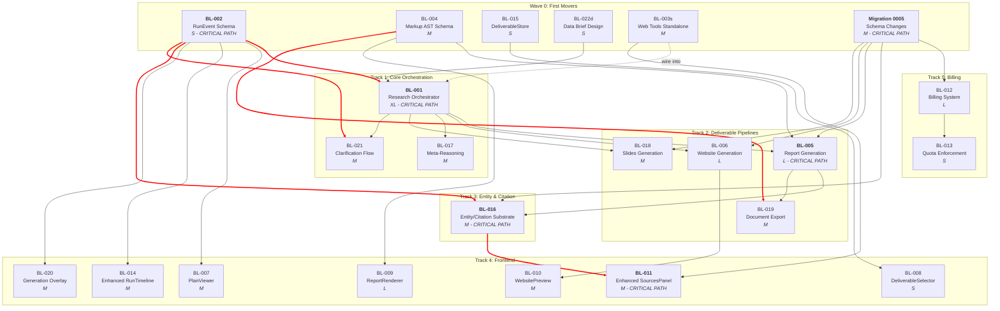

# Dependency Analysis: 22-Item Implementation Backlog

## 1. Corrected Dependency Table

| BL | Name | Listed Deps | Corrected Deps | Corrections & Rationale | Blocks | Complexity |
|----|------|-------------|-----------------|--------------------------|--------|------------|
| BL-001 | Research Orchestrator Graph | BL-002 | **BL-002** | Correct. Orchestrator nodes emit new RunEvent types (PLAN_CREATED, SUBAGENT_*, etc.) so the enum must exist first. However, BL-022 (data brief) is a state-design task that should be done *before* or *concurrent with* the orchestrator build, not after. IMPL-PLAN 1.1 places BL-022 in Week 3 before BL-001 completes -- this is correct sequencing despite BL-022 listing BL-001 as a dep. See BL-022 correction below. | BL-003, BL-005, BL-006, BL-017, BL-018, BL-021, BL-022 | XL |
| BL-002 | RunEvent Schema Extensions | None | **None** | Correct. Pure schema addition to existing enum. No DB migration needed for the enum itself (Python-side enum, not Postgres enum). | BL-001, BL-007, BL-014, BL-016, BL-020, BL-021 | S |
| BL-003 | Web Research MCP Tools | BL-001 | **None (functional); BL-001 (integration)** | **Correction**: The Brave/Jina API wrappers are standalone HTTP clients. They can be built and tested in isolation *before* the orchestrator exists. The integration into `research_worker_node` requires BL-001, but the tool functions themselves do not. Recommend: build tools independently, wire into orchestrator later. This removes BL-003 from the critical path. | BL-011 | M |
| BL-004 | NYQST Markup AST Schema | None | **None** | Correct. Pure Pydantic model creation. Zero platform dependencies. | BL-005, BL-009, BL-019 | M |
| BL-005 | Report Generation Node | BL-001, BL-004 | **BL-001, BL-004, Migration 0005** | **Addition**: BL-005 stores artifacts with `entity_type=GENERATED_REPORT`. This column is added in migration 0005. The IMPL-PLAN confirms this dependency (Phase 2 "Depends on: Phase 0 BL-004 and migration 0005"). The backlog omits it. Also has a soft dep on BL-022 (uses data_brief from state), but BL-022 is incorporated into BL-001's state design. | BL-009, BL-016 (via REFERENCES_FOUND events), BL-019 | L |
| BL-006 | Website Generation Pipeline | BL-001 | **BL-001, Migration 0005** | **Addition**: Same as BL-005 -- stores artifacts with `entity_type=GENERATED_WEBSITE`. Requires the `entity_type` column from migration 0005. Also has implicit dep on BL-022 (uses data_brief). | BL-010 | L |
| BL-007 | PlanViewer Component | BL-002 | **BL-002** | Correct. Consumes PLAN_CREATED and PLAN_TASK_* events from SSE. Does NOT require BL-001 to be complete -- can be built against mock SSE events matching the BL-002 schema. | None (leaf node) | M |
| BL-008 | DeliverableSelector Component | None | **BL-015** | **Addition**: The selector writes to `useDeliverableStore().setSelectedType` (BL-015). While BL-008 could be built with a local state stub, the IMPL-PLAN explicitly couples them ("Selection syncs to useDeliverableStore"). In practice, BL-015 is trivial (S) and should be done first or simultaneously. This is a weak dependency -- both are S/S complexity. | None (leaf node) | S |
| BL-009 | ReportRenderer Component | BL-004 | **BL-004, BL-005** | **Addition**: BL-009 fetches artifact content via `GET /api/v1/artifacts/{sha256}/content` and parses it as MarkupDocument. While the *types* come from BL-004, you need actual report artifacts to meaningfully test the renderer. BL-009 can be built with fixture data from BL-004 alone, but integration requires BL-005. I classify BL-005 as a soft dependency (needed for integration, not unit dev). | None (leaf node) | L |
| BL-010 | WebsitePreview Component | BL-006 | **BL-006** | Correct. Fetches manifest from BL-006's output. Cannot meaningfully test without a website manifest artifact. | None (leaf node) | M |
| BL-011 | Enhanced SourcesPanel | BL-003 | **BL-003, BL-016** | **Addition**: BL-011's web sources tab calls `GET /api/v1/runs/{run_id}/entities?entity_type=web_source`. That endpoint is created in BL-016. The backlog lists only BL-003, which discovers sources, but BL-016 stores them as entity artifacts and exposes the API. Both are needed. | None (leaf node) | M |
| BL-012 | Billing System | None | **Migration 0005** | **Addition**: The billing tables (subscriptions, usage_records) are created in migration 0005 (IMPL-PLAN Phase 0, Section 0.4, Group C). The service code depends on these tables existing. BL-012 cannot start until migration 0005 is applied. However, migration 0005 is a Phase 0 task (Week 2), so this barely constrains BL-012 in practice. | BL-013 | L |
| BL-013 | Quota Enforcement Middleware | BL-012 | **BL-012** | Correct. Middleware queries subscription and usage_records tables populated by BL-012. | None (leaf node) | S |
| BL-014 | Enhanced RunTimeline | BL-002 | **BL-002** | Correct. Adds rendering for new event types. Can be built against mock events. | None (leaf node) | M |
| BL-015 | DeliverableStore (Zustand) | None | **None** | Correct. Standalone Zustand store. Zero dependencies. | BL-008 (weak) | S |
| BL-016 | Entity/Citation Substrate | BL-002 | **BL-002, Migration 0005, BL-005** | **Addition**: Migration 0005 adds `entity_type` and `tags` columns to Artifact. BL-016's service layer (`create_entity_artifact`) needs these columns. Also, entity creation is triggered by REFERENCES_FOUND events during research, which implies the orchestrator (BL-001) exists, though the service code can be built before that. BL-005 is a soft dep: the citation binding between report nodes and entity artifacts requires report generation to exist for integration testing. The IMPL-PLAN schedules BL-016 in Week 6 parallel with BL-005. | BL-011 | M |
| BL-017 | Meta-Reasoning Node | BL-001 | **BL-001** | Correct. A new node added to the orchestrator graph. Cannot exist without the graph. | None (leaf node for v1) | M |
| BL-018 | Slides Deliverable Pipeline | BL-001 | **BL-001, Migration 0005** | **Addition**: Same pattern as BL-005/BL-006 -- stores artifact with `entity_type=GENERATED_PRESENTATION`. Needs migration 0005. | None (leaf node) | M |
| BL-019 | Document Export (PDF/DOCX) | BL-004, BL-005 | **BL-004, BL-005** | Correct. Needs MarkupDocument schema (BL-004) and actual report artifacts to export (BL-005). BL-005 is a hard dependency here -- export converts MarkupDocument to PDF/DOCX, and those documents are produced by report generation. | None (leaf node) | M |
| BL-020 | Generation Progress Overlay | BL-002 | **BL-002** | Correct. Consumes REPORT_PREVIEW_* events from SSE. Can be built against mock events. | None (leaf node) | M |
| BL-021 | Clarification Flow | BL-001, BL-002 | **BL-001, BL-002** | Correct. Requires both the orchestrator (to insert a conditional pause node) and the event schema (CLARIFICATION_NEEDED/RECEIVED). Backend and frontend components. | None (leaf node) | M |
| BL-022 | Shared Data Brief | BL-001 | **None (design); BL-001 (integration)** | **Correction**: The IMPL-PLAN places BL-022 in Week 3, *before* BL-001 is complete (BL-001 spans Weeks 3-4). BL-022 is a *state design* task -- defining the DataBrief schema and adding fields to ResearchState. This must be done *before* or *during* the orchestrator build, not after it. The listed dependency (BL-001) is backwards for the design portion. The integration (synthesis_node populating data_brief) requires BL-001, but the design does not. Recommend: BL-022 design starts in Wave 0 alongside BL-002/BL-004. | BL-005 (data_brief feeds report gen), BL-006 (same) | S |

### Dependency Corrections Summary

| Correction | BL Item | Type | Impact |
|-----------|---------|------|--------|
| BL-003 tools can be built independently | BL-003 | Relaxed | Removes BL-003 from critical path; parallelises with BL-001 |
| BL-022 design has no deps | BL-022 | Relaxed | Moves BL-022 design to Wave 0; reduces critical path length |
| BL-005/006/018 need Migration 0005 | BL-005, BL-006, BL-018 | Added | All deliverable pipelines need `entity_type` column; migration must land first |
| BL-012 needs Migration 0005 | BL-012 | Added | Billing tables in migration 0005; blocks billing service start |
| BL-008 weakly depends on BL-015 | BL-008 | Added | Trivial -- BL-015 is S complexity, do it first |
| BL-011 depends on BL-016 | BL-011 | Added | Sources panel needs entity API endpoint from BL-016 |
| BL-016 soft-depends on BL-005 | BL-016 | Clarified | Entity citation binding needs report gen for integration test |

### Circular Dependency Check

No circular dependencies found. The graph is a DAG. The closest pattern to circularity is BL-022 <-> BL-001, where BL-022 is listed as depending on BL-001 but actually needs to feed into BL-001. This is resolved by splitting BL-022 into design (no deps) and integration (requires BL-001).

---

## 2. Critical Path Analysis

### Identifying the Longest Chain

**Chain A (Research -> Report -> Rendering):**
Migration 0005 -> BL-002 (S) -> BL-001 (XL) -> BL-005 (L) -> BL-009 (L)
Duration: 0005(1w) + S(0.5w) + XL(2w) + L(1.5w) + L(1.5w) = **6.5 weeks**

**Chain B (Research -> Website -> Preview):**
Migration 0005 -> BL-002 (S) -> BL-001 (XL) -> BL-006 (L) -> BL-010 (M)
Duration: 0005(1w) + S(0.5w) + XL(2w) + L(1.5w) + M(1w) = **6 weeks**

**Chain C (Research -> Entity -> Sources UI):**
Migration 0005 -> BL-002 (S) -> BL-001 (XL) -> BL-005 (L) -> BL-016 (M) -> BL-011 (M)
Duration: 0005(1w) + S(0.5w) + XL(2w) + L(1.5w) + M(1w) + M(1w) = **7 weeks**

**Chain D (Billing):**
Migration 0005 -> BL-012 (L) -> BL-013 (S)
Duration: 0005(1w) + L(1.5w) + S(0.5w) = **3 weeks**

**Chain E (Research -> Meta-reasoning):**
BL-002 (S) -> BL-001 (XL) -> BL-017 (M)
Duration: S(0.5w) + XL(2w) + M(1w) = **3.5 weeks**

**Chain F (Research -> Report -> Export):**
BL-004 (M) + BL-002 (S) -> BL-001 (XL) -> BL-005 (L) -> BL-019 (M)
Duration: max(M,S)(1w) + XL(2w) + L(1.5w) + M(1w) = **5.5 weeks**

### Critical Path: Chain C

**Migration 0005 -> BL-002 -> BL-001 -> BL-005 -> BL-016 -> BL-011**

This is the **longest dependency chain at 7 weeks** minimum duration assuming unlimited developers and perfect execution.

### Minimum Project Duration

With unlimited developers: **7 weeks** (Chain C).

With realistic team size (3-5 devs): **10-11 weeks**, accounting for:
- Integration testing between phases (not parallelisable)
- BL-001 (XL) is a single-developer bottleneck that blocks 7 items
- Frontend items require backend event contracts to be stable

### De-risking the Critical Path

1. **BL-001 is the mega-bottleneck.** It blocks BL-003 (integration), BL-005, BL-006, BL-017, BL-018, BL-021, BL-022 (integration). Mitigation: decompose into sub-elements (see Section 5) to allow earlier starts on dependent items.

2. **BL-005 -> BL-016 dependency can be weakened.** BL-016's core service (create_entity_artifact, entity API endpoint) only needs Migration 0005 and BL-002. The citation *binding* to reports needs BL-005, but the entity substrate can be built in parallel. Start BL-016 service layer as soon as Migration 0005 lands.

3. **BL-003 tools can be built Day 1.** The Brave/Jina HTTP wrappers have zero platform dependencies. Build and test them independently, wire into orchestrator when BL-001 is ready. This shortens Chain C by removing the sequential BL-003 step.

4. **BL-009 (ReportRenderer) can start with fixture data.** Define the TypeScript MarkupNode types from BL-004 spec and build the recursive renderer against JSON fixtures. Integration with real artifacts follows when BL-005 is done.

---

## 3. Execution Waves

### Wave 0: True First Movers (no dependencies)
| Item | Name | Complexity | Notes |
|------|------|-----------|-------|
| BL-002 | RunEvent Schema Extensions | S | Unblocks 6 items. Highest leverage. |
| BL-004 | NYQST Markup AST Schema | M | Unblocks BL-005, BL-009, BL-019. |
| BL-015 | DeliverableStore (Zustand) | S | Unblocks BL-008. |
| BL-022* | Shared Data Brief (design only) | S | DataBrief schema + ResearchState field additions. Feeds into BL-001. |
| BL-003* | Web Research Tools (standalone) | M | Build Brave/Jina wrappers without orchestrator integration. |
| Migration 0005 | DB schema changes | M | Unblocks BL-005, BL-006, BL-012, BL-016, BL-018. |

*Corrected from listed dependencies (see Section 1).

**Recommended team**: 3 developers, 1.5 weeks. All items are independent.

### Wave 1: Depends only on Wave 0
| Item | Name | Complexity | Depends On (from Wave 0) |
|------|------|-----------|--------------------------|
| BL-001 | Research Orchestrator Graph | XL | BL-002, BL-022 (design) |
| BL-007 | PlanViewer Component | M | BL-002 |
| BL-008 | DeliverableSelector Component | S | BL-015 |
| BL-009* | ReportRenderer (fixture-driven dev) | L | BL-004 |
| BL-012 | Billing System | L | Migration 0005 |
| BL-014 | Enhanced RunTimeline | M | BL-002 |
| BL-016* | Entity/Citation Substrate (service layer) | M | BL-002, Migration 0005 |
| BL-020 | Generation Progress Overlay | M | BL-002 |

*BL-009 starts with fixture data; full integration requires BL-005 (Wave 2). BL-016 service layer starts; citation binding requires BL-005 (Wave 2).

**Recommended team**: 4-5 developers, 2 weeks. BL-001 is the bottleneck -- assign strongest backend developer.

### Wave 2: Depends on Wave 0 + Wave 1
| Item | Name | Complexity | Depends On |
|------|------|-----------|-----------|
| BL-003* | Web Tools (orchestrator integration) | S | BL-001 (wiring only -- tools already built in Wave 0) |
| BL-005 | Report Generation Node | L | BL-001, BL-004 |
| BL-006 | Website Generation Pipeline | L | BL-001 |
| BL-013 | Quota Enforcement Middleware | S | BL-012 |
| BL-017 | Meta-Reasoning Node | M | BL-001 |
| BL-018 | Slides Deliverable Pipeline | M | BL-001 |
| BL-021 | Clarification Flow | M | BL-001, BL-002 |
| BL-022* | Data Brief (integration) | S | BL-001 (synthesis_node wiring) |

*BL-003 integration and BL-022 integration are small wiring tasks, not full items.

**Recommended team**: 4 developers, 2 weeks. High parallelism possible -- BL-005/006/017/018 are all independent orchestrator nodes.

### Wave 3: Depends on Waves 0-2
| Item | Name | Complexity | Depends On |
|------|------|-----------|-----------|
| BL-009* | ReportRenderer (integration) | S | BL-005 (real artifacts) |
| BL-010 | WebsitePreview Component | M | BL-006 |
| BL-011 | Enhanced SourcesPanel | M | BL-003, BL-016 |
| BL-016* | Entity/Citation (citation binding) | S | BL-005 (binding test) |
| BL-019 | Document Export (PDF/DOCX) | M | BL-004, BL-005 |

*Completion of items started earlier.

**Recommended team**: 3 developers, 1.5 weeks.

### Wave Summary

| Wave | Items | Duration | Parallelism |
|------|-------|----------|-------------|
| 0 | 6 items (BL-002, BL-004, BL-015, BL-022d, BL-003s, Mig0005) | 1.5 weeks | Full |
| 1 | 8 items (BL-001, BL-007, BL-008, BL-009f, BL-012, BL-014, BL-016s, BL-020) | 2 weeks | Full except BL-001 bottleneck |
| 2 | 8 items (BL-003i, BL-005, BL-006, BL-013, BL-017, BL-018, BL-021, BL-022i) | 2 weeks | Full |
| 3 | 5 items (BL-009i, BL-010, BL-011, BL-016c, BL-019) | 1.5 weeks | Full |
| **Total** | **22 items** | **7 weeks** | |

---

## 4. Parallel Developer Tracks

### Track 1: Core Orchestration (Backend Lead)
**Purpose**: Build the research pipeline from schema through orchestrator to deliverable generation.
**Owner**: Senior backend developer with LangGraph experience.

| Order | Item | Complexity | Week |
|-------|------|-----------|------|
| 1 | BL-002 RunEvent Schema | S | 1 |
| 2 | BL-022 Data Brief Design | S | 1 |
| 3 | BL-001 Research Orchestrator | XL | 2-3 |
| 4 | BL-017 Meta-Reasoning Node | M | 4 |
| 5 | BL-021 Clarification Flow (backend) | M | 5 |

**Merge points**:
- After BL-002: unblocks Track 2 (frontend events), Track 3 (entity), Track 5 (billing migration)
- After BL-001: unblocks Track 2 (deliverable nodes), Track 3 (entity integration)

**Risk**: HIGH. BL-001 is the single largest bottleneck. If it slips, Tracks 2/3 are delayed.

### Track 2: Deliverable Pipelines (Backend)
**Purpose**: Build all four deliverable generation nodes and export.
**Owner**: Backend developer comfortable with LLM prompt engineering.

| Order | Item | Complexity | Week |
|-------|------|-----------|------|
| 1 | BL-004 Markup AST Schema | M | 1 |
| 2 | BL-003 Web Tools (standalone) | M | 1-2 |
| 3 | *Wait for BL-001* | - | - |
| 4 | BL-005 Report Generation | L | 3-4 |
| 5 | BL-006 Website Generation | L | 4-5 |
| 6 | BL-018 Slides Generation | M | 5 |
| 7 | BL-019 Document Export | M | 6 |

**Merge points**:
- BL-004 feeds Track 4 (ReportRenderer types)
- BL-005 feeds Track 3 (entity citation binding), Track 4 (report renderer integration)
- BL-003 standalone -> wires into BL-001 once available (brief Track 1 touchpoint)

**Risk**: MEDIUM. Blocked on BL-001 after Week 2. But Weeks 1-2 are productive with BL-004 + BL-003.

### Track 3: Entity & Citation Substrate (Backend)
**Purpose**: Entity storage, citation binding, and the sources API.
**Owner**: Backend developer familiar with SQLAlchemy and the Artifact kernel.

| Order | Item | Complexity | Week |
|-------|------|-----------|------|
| 1 | Migration 0005 (all schema) | M | 1-2 |
| 2 | BL-016 Entity Service Layer | M | 2-3 |
| 3 | *Wait for BL-005 for citation binding* | - | - |
| 4 | BL-016 Citation Binding Integration | S | 4-5 |

**Merge points**:
- Migration 0005: unblocks Track 2 (entity_type column), Track 5 (billing tables)
- BL-016 service: unblocks Track 4 (BL-011 Sources Panel)

**Risk**: LOW. Migration 0005 is straightforward. Entity service is well-defined. Short track with slack time.

**Note**: This developer has capacity after Week 5. Assign to assist Track 1 (BL-021 backend) or Track 4 (frontend integration testing).

### Track 4: Frontend (Full-stack / Frontend)
**Purpose**: All UI components -- plan viewer, selectors, renderers, overlays.
**Owner**: Frontend developer with React/Zustand experience.

| Order | Item | Complexity | Week |
|-------|------|-----------|------|
| 1 | BL-015 DeliverableStore | S | 1 |
| 2 | BL-008 DeliverableSelector | S | 1 |
| 3 | BL-007 PlanViewer | M | 2-3 |
| 4 | BL-020 Generation Overlay | M | 2-3 |
| 5 | BL-014 Enhanced RunTimeline | M | 3-4 |
| 6 | BL-009 ReportRenderer (fixtures) | L | 4-5 |
| 7 | BL-010 WebsitePreview | M | 5-6 |
| 8 | BL-011 Enhanced SourcesPanel | M | 6 |
| 9 | BL-021 Clarification Flow (frontend) | M | 6-7 |
| 10 | BL-009 ReportRenderer (integration) | S | 7 |

**Merge points**:
- BL-007/014/020 consume events from Track 1 (BL-002 schema). Can build against mocks.
- BL-009 integration requires Track 2 (BL-005 report artifacts)
- BL-010 requires Track 2 (BL-006 website manifests)
- BL-011 requires Track 3 (BL-016 entity API)
- BL-021 frontend requires Track 1 (BL-021 backend)

**Risk**: MEDIUM. Can mock SSE events for early development. Integration testing requires backend tracks to be ahead.

**Strategy for independence**: Define SSE event JSON contracts from BL-002 on Day 1. Frontend builds against contract, backend implements against contract. Contract is the interface.

### Track 5: Billing (Independent)
**Purpose**: Stripe integration, subscriptions, quota enforcement.
**Owner**: Backend developer or part-time contributor.

| Order | Item | Complexity | Week |
|-------|------|-----------|------|
| 1 | *Wait for Migration 0005* | - | Week 2 |
| 2 | BL-012 Billing System | L | 2-4 |
| 3 | BL-013 Quota Enforcement | S | 4-5 |

**Merge points**:
- Depends on Track 3 for Migration 0005 (Week 2 at latest)
- No downstream merge -- billing is fully independent

**Risk**: LOW. Can be developed against Stripe test mode. No interaction with research/deliverable code. Port from existing okestraai/DocuIntelli codebase reduces risk further.

### Track Convergence Map

```
Week 1-2:  Track 1 ──┐    Track 2 ──┐    Track 3 ──┐    Track 4 ──┐    Track 5 (waiting)
                      │              │              │              │
Week 2:    ───────────┼──────────────┼── Mig 0005 ──┼──────────────┤── Track 5 starts
                      │              │              │              │
Week 3:    BL-001 ────┼── (blocked) ─┤              │     (mocks) ─┤
                      │              │              │              │
Week 4:    ───────────┤── BL-005 ────┤── BL-016 bind┤── BL-009 ───┤── BL-012
                      │              │              │              │
Week 5:    BL-017 ────┤── BL-006 ────┤              │── BL-010 ───┤── BL-013
                      │              │              │              │
Week 6-7:  BL-021 ────┼── BL-019 ───┤              │── BL-011 ───┤
                      │              │              │              │
Week 7:    ═══════════╧══════════════╧══════════════╧══════════════╧═══ INTEGRATION
```

---

## 5. Sub-element DAGs (5 Largest Items)

### BL-001: Research Orchestrator Graph (XL)

```
BL-001a: ResearchState extension
         (add query, deliverable_type, plan, task_results, data_brief,
          web_sources, child_run_ids fields with defaults)
         Deps: BL-022 design
         Duration: 0.5d
              │
BL-001b: planner_node implementation
         (LLM call to decompose query -> ResearchTask list, emit PLAN_CREATED)
         Deps: BL-001a, BL-002
         Duration: 2d
              │
BL-001c: fan_out node + Send() dispatch
         (returns Send() list, emits SUBAGENT_DISPATCHED per task)
         Deps: BL-001b
         Duration: 2d
              │
BL-001d: research_worker_node
         (wraps existing agent+tools loop, creates child Run with parent_run_id,
          emits PLAN_TASK_STARTED/COMPLETED)
         Deps: BL-001c
         Duration: 3d
              │
BL-001e: fan_in_node + TaskResult accumulation
         (reduce pattern, emits SUBAGENT_COMPLETED)
         Deps: BL-001d
         Duration: 1d
              │
BL-001f: synthesis_node
         (LLM call -> DataBrief from TaskResults)
         Deps: BL-001e
         Duration: 1d
              │
BL-001g: deliverable_router
         (conditional routing by deliverable_type)
         Deps: BL-001f
         Duration: 0.5d
              │
BL-001h: graph wiring + entry point modification
         (modify agent.py POST /agent/chat to accept deliverable_type,
          enforce <answer> format in system prompt)
         Deps: BL-001g
         Duration: 1d
```

**Parallelism opportunity**: BL-001a is a prerequisite for everything, but BL-001d (worker node) can be developed in isolation and tested standalone while BL-001b/c are in progress, since it just wraps the existing agent loop. Wire it in when fan_out is ready.

**Total sequential duration**: ~11 days (~2.2 weeks). With BL-001d parallel: ~9 days (~1.8 weeks).

### BL-005: Report Generation Node (L)

```
BL-005a: Outline pass
         (LLM: DataBrief + query -> section outline)
         (emit REPORT_PREVIEW_START)
         Deps: BL-001 (orchestrator exists), BL-004 (MarkupNode types)
         Duration: 1d
              │
BL-005b: Section generation (parallel Send per section)  ◄── can start with BL-005a
         (LLM: section_heading + task_results -> MarkupNode subtree)
         (embed citation_ids from data_brief entities)
         (emit REPORT_PREVIEW_DELTA per section)
         Deps: BL-005a
         Duration: 2d
              │
BL-005c: Review pass
         (LLM: full draft -> identify improvements, targeted rewrites)
         Deps: BL-005b
         Duration: 1d
              │
BL-005d: Assembly + storage
         (assemble MarkupDocument, run MarkupHealer,
          store as Artifact with entity_type=GENERATED_REPORT,
          set message.first_report_identifier,
          emit REPORT_PREVIEW_DONE + ARTIFACT_CREATED)
         Deps: BL-005c, Migration 0005 (entity_type column)
         Duration: 1d
              │
BL-005e: Co-generation trigger (for WEBSITE deliverable_type)
         (dispatch companion report via arq job)
         Deps: BL-005d
         Duration: 0.5d
```

**Total sequential duration**: ~5.5 days (~1.1 weeks).

### BL-006: Website Generation Pipeline (L)

```
BL-006a: Planning stage
         (LLM -> page structure, tech stack)
         Deps: BL-001 (deliverable router)
         Duration: 1d
              │
BL-006b: Scaffolding + Content stages
         (LLM -> HTML/CSS/JS skeleton + content fill from DataBrief)
         Deps: BL-006a
         Duration: 2d
              │
BL-006c: Styling + Data viz stages
         (LLM -> CSS refinement, chart/table embedding)
         Deps: BL-006b
         Duration: 1d
              │
BL-006d: Review stage
         (LLM -> critique + fix pass)
         Deps: BL-006c
         Duration: 1d
              │
BL-006e: Bundle + storage
         (each file -> Artifact, group into Manifest,
          tag root with entity_type=GENERATED_WEBSITE,
          emit MANIFEST_CREATED + REPORT_PREVIEW_DONE)
         Deps: BL-006d, Migration 0005
         Duration: 1d
              │
BL-006f: Co-generation: trigger companion report
         (invoke BL-005 pipeline via arq)
         Deps: BL-006e, BL-005 (report pipeline exists)
         Duration: 0.5d
```

**Total sequential duration**: ~6.5 days (~1.3 weeks).

### BL-012: Billing System (L)

```
BL-012a: ORM models for subscriptions + usage_records
         Deps: Migration 0005 (tables exist)
         Duration: 0.5d
              │
BL-012b: StripeService (checkout session creation, webhook signature verify)
         Deps: BL-012a (models for DB writes)
         Duration: 2d
              │
BL-012c: SubscriptionService (CRUD, status transitions)    ◄── parallel with BL-012b
         Deps: BL-012a
         Duration: 1d
              │
BL-012d: UsageService (record creation, period queries)    ◄── parallel with BL-012b
         Deps: BL-012a
         Duration: 1d
              │
BL-012e: Webhook handler (event routing, idempotency)
         Deps: BL-012b, BL-012c
         Duration: 1d
              │
BL-012f: API routes (checkout, portal, webhook, subscription, usage)
         Deps: BL-012b, BL-012c, BL-012d, BL-012e
         Duration: 1d
              │
BL-012g: Integration testing with Stripe test mode
         Deps: BL-012f
         Duration: 1d
```

**Parallelism**: BL-012b/c/d can all proceed in parallel after BL-012a.

**Total sequential duration**: ~5.5 days (with parallelism), ~7.5 days (sequential). ~1.1-1.5 weeks.

### BL-016: Entity/Citation Substrate (M)

```
BL-016a: ArtifactEntityType enum + schema updates
         (add entity_type, tags to ArtifactCreate/ArtifactResponse)
         Deps: Migration 0005
         Duration: 0.5d
              │
BL-016b: create_entity_artifact() service method
         (URL -> sha256 dedup key, store with entity_type + tags)
         Deps: BL-016a
         Duration: 1d
              │
BL-016c: GET /runs/{run_id}/entities API endpoint
         (query artifacts by entity_type, grouped response)
         Deps: BL-016b
         Duration: 0.5d
              │
BL-016d: Async entity creation arq job
         (triggered by REFERENCES_FOUND event,
          creates entity artifacts in background)
         Deps: BL-016b, BL-002 (REFERENCES_FOUND event type)
         Duration: 1d
              │
BL-016e: Citation binding integration
         (report MarkupNode.citation_ids -> entity artifact lookup,
          verify round-trip: research -> entity -> report citation -> renderer)
         Deps: BL-016d, BL-005 (report artifacts with citations)
         Duration: 1d
```

**Total sequential duration**: ~4 days (~0.8 weeks). BL-016e is the only part needing BL-005.

---

## 6. First-Mover Recommendations

Start these on Day 1. Listed in priority order by strategic leverage.

### 1. BL-002: RunEvent Schema Extensions
**Rationale**: Unblocks 6 downstream items (BL-001, BL-007, BL-014, BL-016, BL-020, BL-021). S complexity (half-day to one day). Pure additive change to existing enum -- zero risk of breaking anything. Defines the SSE event contract that the entire frontend track will build against. **Highest leverage-to-effort ratio of any item.**

### 2. BL-004: NYQST Markup AST Schema
**Rationale**: Unblocks 3 items (BL-005, BL-009, BL-019). M complexity but well-defined (18 node types from spec). Zero platform dependencies -- pure Pydantic models. Also produces the TypeScript type definitions that Track 4 (frontend) needs for BL-009 ReportRenderer. **Parallelises perfectly with BL-002.**

### 3. Migration 0005
**Rationale**: Unblocks BL-005, BL-006, BL-012, BL-016, BL-018. All deliverable pipelines and billing depend on schema columns added here. Groups three concerns (entity_type, message extensions, billing tables) into one migration -- efficient. **Must land in Week 1 to avoid blocking Waves 1-2.**

### 4. BL-022 (Design only): Shared Data Brief
**Rationale**: Defines the DataBrief schema and ResearchState field additions that BL-001 needs. S complexity (schema + dataclass fields). Doing this first ensures BL-001 developer has the state shape locked before building orchestrator nodes. **Reduces uncertainty for the project's biggest bottleneck.**

### 5. BL-003 (Standalone): Web Research Tools
**Rationale**: Brave/Jina HTTP wrappers are self-contained. Building them Day 1 (a) proves external API access works, (b) surfaces any API key/rate limit issues early, (c) removes them from the critical path. When BL-001 is ready, wiring is trivial. **Reduces external dependency risk.**

### 6. BL-015: DeliverableStore
**Rationale**: S complexity (< 2 hours). Unblocks BL-008. Gets the frontend developer productive on Day 1 while waiting for BL-002 event contracts. **Zero risk, immediate productivity.**

---

## 7. Risk Assessment

### Risk 1: BL-001 Orchestrator Bottleneck (CRITICAL)
**Description**: BL-001 is XL complexity and blocks 7 items directly. Any delay cascades across the entire project. The Send() fan-out pattern with async DB sessions is technically challenging.
**Likelihood**: Medium-High
**Impact**: 1-2 week cascade delay
**Mitigation**:
- Assign the strongest backend developer exclusively to BL-001
- Decompose into sub-elements (Section 5) and verify each milestone
- Build BL-001d (worker node) in parallel with BL-001b/c to compress the timeline
- Have a fallback plan: if Send() fan-out proves unstable, implement sequential fan-out first and optimise later

### Risk 2: Migration 0005 Conflicts (MEDIUM)
**Description**: Migration 0005 touches three tables (artifacts, messages, new billing tables) in one migration. If any column type conflicts with existing models or the Message model from migration 0004 has undocumented constraints, the migration fails.
**Likelihood**: Low-Medium
**Impact**: 2-3 day delay + potential schema redesign
**Mitigation**:
- Read `db/models/conversations.py` and `db/models/substrate.py` thoroughly before writing migration
- Test migration on a fresh DB with all 4 prior migrations applied
- Keep rollback (`downgrade()`) clean and tested
- Consider splitting into 0005a (entity) + 0005b (message) + 0005c (billing) if conflicts arise

### Risk 3: BL-005/006 LLM Output Quality (MEDIUM)
**Description**: Report and website generation rely on LLM producing valid JSON (MarkupDocument) or clean HTML. Complex documents may produce malformed output, especially with parallel section generation.
**Likelihood**: Medium
**Impact**: 1 week of prompt engineering iterations
**Mitigation**:
- MarkupHealer (BL-004) is the safety net -- build it robust from Day 1
- Use structured output mode (function calling / JSON mode) rather than free-form generation
- Add HTMLParser validation for website output
- Start with simple 3-section reports; scale complexity after validation

### Risk 4: LangGraph Send() API Stability (MEDIUM)
**Description**: The LangGraph `Send()` API for dynamic fan-out is relatively new. Async DB sessions across parallel nodes may have lifecycle issues. The installed LangGraph version may not match documentation.
**Likelihood**: Medium
**Impact**: 3-5 day delay if API behaves differently than expected
**Mitigation**:
- Check installed LangGraph version before Phase 1 starts
- Build a minimal Send() prototype in Week 1 (during orientation) to validate the pattern
- Use per-node session factory injection, not shared sessions
- Pin LangGraph version in pyproject.toml

### Risk 5: Frontend-Backend Contract Drift (LOW-MEDIUM)
**Description**: Track 4 (frontend) builds against mock SSE events from Week 1. If the actual event payloads from Track 1 differ from the BL-002 spec, integration breaks.
**Likelihood**: Low-Medium
**Impact**: 2-3 days of frontend fixes during integration
**Mitigation**:
- Lock BL-002 event payload schemas as TypeScript interfaces on Day 1
- Frontend and backend share a single source of truth (e.g., generate TS types from Pydantic schemas)
- Run integration smoke tests weekly, not just at phase boundaries
- Contract tests: backend tests assert payload shapes match spec

### Risk 6: Billing Port Complexity (LOW)
**Description**: BL-012 ports Stripe code from okestraai/DocuIntelli (Supabase/Node.js) to FastAPI/SQLAlchemy. The Supabase auth model differs from the JWT+API key system. Webhook handling patterns differ.
**Likelihood**: Low
**Impact**: 2-3 day delay
**Mitigation**:
- Port the *logic*, not the code -- rewrite in FastAPI idioms
- Stripe SDK is language-agnostic in concept; the Python SDK is well-documented
- Test against Stripe test mode from Day 1
- Track 5 is fully independent, so delays don't cascade

### Risk 7: Co-generation Pattern Complexity (MEDIUM)
**Description**: A WEBSITE request must produce both a website manifest AND a companion report artifact. This involves BL-006 triggering BL-005 via arq background job. Race conditions between the main response stream and the background report job could cause the AI message to reference artifacts that don't exist yet.
**Likelihood**: Medium
**Impact**: 1-2 days of debugging, potential UX jank
**Mitigation**:
- Use `has_async_entities_in_progress` flag pattern (already confirmed from chat export)
- Frontend shows "Creating report..." indicator while background job runs
- Report artifact reference in `hydrated_content` uses lazy loading -- renderer fetches when available
- Implement co-generation as the *last* feature in Phase 2, after both BL-005 and BL-006 work independently

---

## 8. Mermaid Dependency Diagram



### Critical Path (bold in diagram)

```
Migration 0005 --> BL-002 --> BL-001 --> BL-005 --> BL-016 --> BL-011
     (M)           (S)         (XL)       (L)        (M)        (M)
   1 week       0.5 week    2 weeks    1.5 weeks   1 week     1 week
                                                          = 7 weeks total
```

Note: Migration 0005 and BL-002 are parallel in Wave 0 (both have no deps), so the critical path length through them is max(1w, 0.5w) = 1 week, not 1.5 weeks. The true critical path is therefore:

```
[Wave 0: 1 week] --> BL-001 [2 weeks] --> BL-005 [1.5 weeks] --> BL-016 [1 week] --> BL-011 [1 week]
= 6.5 weeks minimum
```

---

## Appendix: Complexity Calibration

| Rating | Duration Estimate | Example Items |
|--------|------------------|---------------|
| S | 0.5-1 week | BL-002, BL-008, BL-013, BL-015, BL-022 |
| M | 1-1.5 weeks | BL-003, BL-004, BL-007, BL-010, BL-011, BL-014, BL-016, BL-017, BL-018, BL-019, BL-020, BL-021 |
| L | 1.5-2 weeks | BL-005, BL-006, BL-009, BL-012 |
| XL | 2-3 weeks | BL-001 |

Estimates assume one developer per item, including unit tests but not integration testing.
