# Implementation Plan v3: Platform Primitives via Research Module

---

## 1. Strategic Context

This implementation plan governs the construction of ten platform primitives on the `nyqst-intelli-230126` codebase. The primitives are proven through a Research Module that serves as the integration test harness. This is not "build a research tool." It is "build reusable horizontal platform infrastructure, validated end-to-end by the most demanding consumer module." The strategic framing is defined authoritatively in REF-016 (PLATFORM-FRAMING.md).

The PRD vision (REF-022) defines NYQST as a Cognitive ERP for regulated mid-cap enterprise, targeting ~$200k/year deployments across PropSygnal (CRE intelligence), Debt & Credit MVP (covenant monitoring), RegSygnal (regulatory monitoring), and Lease Critical Dates (the commercial wedge). Each domain module requires the same ten platform primitives. Building them once through the research module and proving them under the hardest orchestration case — 13+ parallel workstreams, four deliverable types, real-time streaming, citation binding, cost tracking — means every subsequent domain module inherits proven infrastructure without reimplementation.

The three-layer architecture from REF-016 governs all sequencing: Layer 1 (Platform Primitives) is built and proven through this plan. Layer 2 (Domain Modules) plugs into proven primitives. Layer 3 (Enterprise Shell) wraps the platform for regulated deployment. This plan covers Layer 1 only.

### The 10 Platform Primitives

| # | Primitive | Description | Primary BL Items |
|---|-----------|-------------|-----------------|
| 1 | **Agentic Runtime** | LangGraph orchestrator with StateGraph, Send() fan-out, supervisor/coordinator pattern, child run tracking, AsyncPostgresSaver checkpointing | BL-001, BL-017, BL-021 |
| 2 | **GENUI (Generative UI)** | NYQST Markup AST (18 node types), GML tag system, healer/fixer pipeline, rehype-to-JSX rendering, ReportRenderer, WebsitePreview | BL-004, BL-005, BL-006, BL-009, BL-010, BL-018 |
| 3 | **MCP Tool Layer** | Namespaced `{domain}.{resource}.{action}` tool interface, session-scoped discovery, hot-swappable providers via MCP protocol | BL-003 |
| 4 | **Document Management** | Content-addressed artifacts (SHA-256 PK), manifests, pointers, entity_type taxonomy, sessions, projects | BL-016, Migration 0005 |
| 5 | **Provenance & Citation** | Source tracking from extraction through rendering, entity/citation substrate, citation IDs linking output nodes to source entities | BL-016, BL-011 |
| 6 | **Context Engineering** | Data briefs, scratchpads, contextual corpus assembly, knowledge inheritance across sessions | BL-022 |
| 7 | **LLM Integration** | ChatOpenAI with base_url override, config-driven model selection, with_structured_output() enforcement, budget enforcement in LangGraph state | BL-001 |
| 8 | **Reactive State & Streaming** | Dual-stream SSE (AI SDK + PG LISTEN/NOTIFY), Zustand stores, RunEvent lifecycle | BL-002, BL-015, BL-020 |
| 9 | **Agent Management** | Graph definitions, node configurations, tool registries, policy templates, human-in-the-loop approval | BL-021 |
| 10 | **Billing & Metering** | Run cost tracking, Stripe integration, quota enforcement, per-run cost attribution | BL-012, BL-013 |

### Platform Primitive Reuse Matrix

Every domain module consumes all ten primitives. The bottom three rows are Layer 2 extensions built after this plan completes.

| Primitive | Research | Lease CDs | Debt MVP | PropSygnal | RegSygnal |
|-----------|----------|-----------|----------|------------|-----------|
| Agentic Runtime | Y | Y | Y | Y | Y |
| GENUI | Y | Y | Y | Y | Y |
| MCP Tools | Y | Y | Y | Y | Y |
| Document Mgmt | Y | Y | Y | Y | Y |
| Provenance | Y | Y | Y | Y | Y |
| Context Eng. | Y | Y | Y | Y | Y |
| LLM Integration | Y | Y | Y | Y | Y |
| Streaming | Y | Y | Y | Y | Y |
| Agent Mgmt | Y | Y | Y | Y | Y |
| Billing | Y | Y | Y | Y | Y |
| Deterministic Calc | -- | -- | Y | Y | -- |
| Event Engine | -- | Y | Y | -- | Y |
| Doc Processing | partial | Y | Y | -- | Y |

---

## 2. Repository & Build Context

### Repositories

| Repository | Path / URL | Purpose |
|-----------|-----------|---------|
| **nyqst-intelli-230126** | `/Users/markforster/NYQST-DevinForkByAnyMeans/nyqst-intelli-230126` | Dev platform — ALL code is built here |
| **AirTable-SuperAgent** | `/Users/markforster/AirTable-SuperAgent` | Analysis docs + cached JS from superagent.com (docs only, no code) |
| **okestraai/DocuIntelli** | GitHub (public) | Stripe billing code to port (Supabase, Node.js) |
| **t3rm1nu55/NYQST-DocuIntelli160126** | GitHub | Older Node/tRPC version (reference only) |

### Technology Stack

**Backend:** Python 3.14 + FastAPI + LangGraph + SQLAlchemy 2.0 async + Alembic + Pydantic v2 + arq (Redis job queue)

**Frontend:** React + Vite + TypeScript + @assistant-ui/react + shadcn/ui + Zustand + Tailwind CSS

**Infrastructure:** PostgreSQL (pgvector) + MinIO (S3-compatible) + Redis + Docker Compose

**LLM:** ChatOpenAI (langchain-openai) with `base_url` override for model routing. Default: gpt-4o-mini. No Anthropic SDK in v1.

### How to Run

```bash
# Infrastructure
docker-compose up -d   # Postgres (5433), MinIO (9000/9001), Redis (6379)

# Backend
cd /Users/markforster/NYQST-DevinForkByAnyMeans/nyqst-intelli-230126
uv run alembic upgrade head
uv run uvicorn src.intelli.main:app --reload

# Frontend
cd ui && npm run dev
```

### Branch Strategy

Feature branches off `main`. PR review required before merge. Conventional commit messages.

---

## 3. What We Get For Free

Before any new code, the platform provides these capabilities. Do not re-implement them.

| Capability | File(s) | Status |
|---|---|---|
| JWT + API key auth, multi-tenant | `api/middleware/auth.py`, `db/models/auth.py` | Production-ready |
| Artifact upload/download (S3/MinIO) | `services/substrate/artifact_service.py`, `api/v1/artifacts.py` | Production-ready |
| Manifest creation/history/diff/tree | `services/substrate/manifest_service.py`, `api/v1/manifests.py` | Production-ready |
| Pointer advance/reset/history | `repositories/pointers.py`, `api/v1/pointers.py` | Production-ready |
| RAG: index + ask (pgvector + OpenSearch) | `services/knowledge/rag_service.py`, `api/v1/rag.py` | Production-ready |
| Run lifecycle CRUD + events (append-only ledger) | `services/runs/ledger_service.py`, `api/v1/runs.py` | Production-ready |
| SSE streaming via PG LISTEN/NOTIFY | `api/v1/streams.py`, `core/pubsub.py` | Production-ready |
| Working LangGraph research agent (3-node loop) | `agents/graphs/research_assistant.py` | Production-ready |
| AsyncPostgresSaver checkpointer | `db/checkpointer.py` | Production-ready |
| Conversations/messages/message_feedback | `db/models/conversations.py`, `api/v1/conversations.py` | Production-ready |
| Sessions (scoped work context) | `db/models/runs.py` (session_id FK), `api/v1/sessions.py` | Production-ready |
| Tags (multi-entity taxonomy) | `db/models/tags.py`, `api/v1/tags.py` | Production-ready |
| Run.parent_run_id (self-referential FK) | `db/models/runs.py` | Available |
| Run.cost_cents + token_usage JSONB | `db/models/runs.py` | Available |
| Background jobs: arq + Redis | `core/jobs.py`, docker-compose redis | Available (UNVERIFIED -- worker process must be confirmed operational before Wave 1) |
| MCP tools: search_documents, list_notebooks, get_document_info, compare_manifests | `agents/tools/research_tools.py`, `mcp/tools/knowledge_tools.py` | Production-ready |
| Langfuse observability hook | `agents/observability.py` | Config-wired |
| Frontend SSE event hook | `ui/src/hooks/use-sse.ts` | Working |
| Frontend citation components | `CitationAwareText.tsx`, `CitationLink.tsx`, `SourcesPanel.tsx`, `SourcesSidebar.tsx` | Partially built |
| 5 Zustand stores | `ui/src/stores/{auth,conversation,workbench,run,tour}-store.ts` | Working |

---

## 4. Platform Ground Truth

Source: `/Users/markforster/NYQST-DevinForkByAnyMeans/nyqst-intelli-230126` (REF-004)

**LangGraph**: NOT empty. `src/intelli/agents/graphs/research_assistant.py` contains a complete `ResearchAssistantGraph` with `StateGraph`, three nodes (agent/tools/capture_sources), a real tool-use loop, and `AsyncPostgresSaver` checkpointer. The graph must be EXTENDED, not replaced.

**Migrations**: FOUR exist, not three.
- `20260123_0001_initial_substrate.py` -- artifacts, manifests, pointers, pointer_history, runs, run_events
- `20260123_0002_auth_tables.py` -- tenants, users, api_keys
- `20260124_0003_rag_chunks.py` -- rag_chunks
- `20260201_0004_conversations_sessions_tags.py` -- sessions, conversations, messages, message_feedback, tags
- Next migration: **0005** (split into 0005a/b/c per DEC-052)

**LLM**: OpenAI-only. Only `langchain-openai` installed. Default model `gpt-4o-mini`. Supports `base_url` override. No Anthropic SDK.

**Run model**: Has `parent_run_id` (self-referential FK). Child runs map to fan-out workstreams. Has `cost_cents` (int) + `token_usage` (JSONB).

**Artifact model**: Pure blob record. No `entity_type`, no metadata JSONB. Adding `entity_type` requires migration 0005a.

**SSE**: Production-ready via PG LISTEN/NOTIFY. `GET /api/v1/streams/runs/{run_id}` and `GET /api/v1/streams/activity`. Do NOT add new streaming mechanisms.

**Response format** (REF-005): LLM wraps responses in `<answer>...</answer>`. `<gml-*>` tags reference deliverables. `hydrated_content` stores rendered HTML.

**Co-generation** (REF-005): WEBSITE produces companion REPORT. Both `gml-ViewWebsite` and `gml-ViewReport` in same response.

**Entity creation is async**: `has_async_entities_in_progress` flag. arq + Redis for post-processing.

**Billing unit** (REF-005): 1 run = 1 AI generation message. Reads free. $20/mo = 200 runs. $0.50/run overage.

---

## 5. Locked Decisions

All decisions are locked. No open questions remain. Decisions DEC-042 through DEC-052 were resolved during the strategic review session (2026-02-19). The full register is in REF-019.

### 5A: Scope Decisions

| DEC-ID | Decision | Source |
|--------|----------|--------|
| DEC-001 | v1 includes: Research orchestrator, Report/Website/Slides/Document deliverables, Billing & quotas, Doc upload + RAG, Deliverable selector UI, Plan viewer + enhanced timeline UI | REF-007, REF-009 |
| DEC-002 | Deferred to v2: Scheduled tasks, Content library, Browser agent, Public share, Replay bar, Push notifications | REF-007, REF-014 |
| DEC-003 | Meta-reasoning node included in v1 despite 30-60s latency cost | REF-009 |
| DEC-004 | Clarification flow: schema now, defer full pause/resume UI to v1.5 | REF-011 |
| DEC-005 | Feature flags: websiteDeliverableEnabled, documentDeliverableEnabled, fileUploadEnabled, enhancedReportEnabled, multiSectionReportStreamingEnabled | REF-005 |

### 5B: Architecture Decisions

| DEC-ID | Decision | Source |
|--------|----------|--------|
| DEC-010 | Pragmatic vertical architecture, not meta-architecture | REF-007 |
| DEC-011 | React + Vite + FastAPI (not Next.js) | REF-007 |
| DEC-012 | Extend ResearchAssistantGraph (do not replace) | REF-004, REF-011 |
| DEC-013 | Dynamic Send() per plan task (not fixed N workers) | REF-011 |
| DEC-014 | Plans stored as RunEvents (no new tables) | REF-007, REF-009 |
| DEC-015a | Backend: MarkupDocument JSON AST (Pydantic) for report generation and storage | Split from DEC-015 |
| DEC-015b | Frontend: rehype-to-JSX pipeline for GML rendering -- skip JSON AST intermediate layer | Split from DEC-015 |
| DEC-016 | Extend Artifact with entity_type field (no new entity table) | REF-009 |
| DEC-017 | Async entity creation via arq background worker | REF-005, REF-004 |
| DEC-018 | Extend existing streams.py for SSE (no new mechanism) | REF-004 |
| DEC-019 | Next migration is 0005 (four exist: 0001-0004) | REF-004 |
| DEC-020 | Chat UI streaming: AI SDK Data Stream Protocol (not NDJSON) | REF-014 |
| DEC-021 | Two parallel SSE streams: chat (AI SDK) + run events (PG LISTEN/NOTIFY) | REF-014 |
| DEC-022 | Response format: `<answer>...</answer>` with `<gml-*>` component refs | REF-005 |
| DEC-023 | deliverable_type on user Message, not Conversation | REF-005 |
| DEC-024 | Co-generation: WEBSITE auto-generates companion REPORT | REF-005 |
| DEC-025 | Billing unit: 1 run = 1 AI message; reads free; retries not double-billed | REF-005 |

### 5C: Technology Choices

| DEC-ID | Decision | Source |
|--------|----------|--------|
| DEC-030 | PDF export: weasyprint (server-side) | REF-009 |
| DEC-031 | Slides format: reveal.js HTML bundle | REF-011 |
| DEC-032 | Web search: Brave Search API (superseded by DEC-046 for MCP wrapping) | REF-011 |
| DEC-033 | Web scraping: Jina Reader API | REF-010 |
| DEC-034 | NOT replicating v0.app; direct LLM code gen | REF-009, REF-010 |
| DEC-035 | Website deploy: iframe preview only in v1 | REF-011 |
| DEC-036 | Billing code ported from okestraai/DocuIntelli | REF-007, REF-015 |
| DEC-037 | Langfuse self-hosted (MIT) for observability. Budget enforcement via LangGraph state token accumulator. Langfuse REST API for billing data export. LiteLLM auto-feeds cost data. | REF-010, REF-024 |
| DEC-038 | Auth: existing intelli JWT + API keys (not Ory Kratos) | REF-010 |
| DEC-039 | Financial data: connector pattern (user configures API keys) | REF-009, REF-010 |
| DEC-040a | Backend Pydantic healer for MarkupDocument validation | Split from DEC-040 |
| DEC-040b | Frontend TypeScript HAST healer for GML rendering pipeline | Split from DEC-040 |
| DEC-041 | @assistant-ui/react for chat UI | REF-014 |

### 5D: New Decisions (resolved 2026-02-19)

| DEC-ID | Decision | Resolves |
|--------|----------|----------|
| DEC-042 | LiteLLM multi-provider hot-swap -- stay OpenAI-only for v1, add LiteLLM as proxy for cost tracking. Do NOT add langchain-anthropic. | OQ-001 |
| DEC-043 | GML renders in separate ReportPanel with rehype-to-JSX pipeline -- NOT inside @assistant-ui/react Thread. New deps: unified, rehype-parse, rehype-react. | OQ-005 |
| DEC-044 | Website: iframe-only for v1 demos. No unauthenticated URL route. | OQ-003, confirms DEC-035 |
| DEC-045 | Langfuse self-hosted (MIT) + LangGraph state budget enforcement ($2/run hard limit). Budget via token accumulator + conditional edge to END. Langfuse REST API for billing export. LiteLLM auto-feeds cost data. | OQ-004 |
| DEC-046 | Search via MCP protocol -- hot-swap Brave/Tavily without code changes. Supersedes DEC-032 (Brave-specific). | New |
| DEC-047 | Clarification UI deferred to v1.5. v1: schema (BL-002 events) + backend pause/resume + text-only "needs input" banner. | OQ-007 |
| DEC-048 | Plotly.js (react-plotly.js) for charts -- NOT Recharts. Recharts cannot do candlestick charts needed for financial data. Neither is currently installed. | Chart library conflict |
| DEC-049 | LangSmith Studio (free) for LangGraph debugging + graph.get_graph().draw_mermaid() for visualization. No visual graph editor -- graph-as-code only (no OSS editor supports Send() fan-out). | REF-025 |
| DEC-050 | LLM structured output: use LangChain with_structured_output(PydanticModel) for all JSON-producing nodes. Free-form only for website HTML. | STRATEGIC-REVIEW DG-3 |
| DEC-051 | DB sessions in parallel Send() nodes: each node creates new session from shared async_sessionmaker, scoped to node function lifetime. expire_on_commit=False. | STRATEGIC-REVIEW DG-5 |
| DEC-052 | Migration 0005 split: 0005a (artifact entity_type + tags), 0005b (message extensions), 0005c (billing tables). Independent migrations. | STRATEGIC-REVIEW DG-6, AR-3 |

### 5E: Testing Strategy

| DEC-ID | Decision | Source |
|--------|----------|--------|
| DEC-050t | Real LLM calls, minimal mocking; contract + integration + E2E pyramid | REF-007, REF-015 |
| DEC-051t | CI budget: max_tokens=2000, gpt-4o-mini for integration test LLM calls | REF-015 |
| DEC-052t | CI cadence: contract on push, integration on PR merge, E2E weekly | REF-015 |

### 5F: Not Replicating

| DEC-ID | Item | Rationale |
|--------|------|-----------|
| DEC-060 | v0.app | Direct LLM code gen instead |
| DEC-061 | Firecrawl | Jina Reader API |
| DEC-062 | FactSet | Data connector pattern |
| DEC-063 | Ory Kratos | Existing intelli auth |
| DEC-064 | PostHog | Existing Langfuse |
| DEC-065 | Sanity CMS | Deferred to v2 |
| DEC-066 | OneSignal | Not needed for internal tool |
| DEC-067 | OTEL trace viewer | Langfuse provides equivalent |

### 5G: v1 Exclusions

- Recursive meta-reasoning (one recovery round max)
- Multi-page websites (single-page only)
- Responsive/animated websites
- Advanced chart types beyond v1 set (bar, line, pie, scatter, table in v1; candlestick, 3D, funnel deferred)
- Rich clarification UI (simple text input banner only)
- Billing dashboard UI (beyond plan status card + usage indicator)
- Public website URLs (`/website/[id]`)
- Data retention automation (manual cleanup in v1)
- Custom report templates, editable report UI, table of contents UI

---

## 6. Corrected Dependency Graph

The dependency analysis (REF-018) identified six corrections to the v2 plan's dependency graph:

| # | Correction | Impact |
|---|-----------|--------|
| 1 | BL-003 tools can be built standalone (removes from critical path) | Parallelises with BL-001 in Wave 0 |
| 2 | BL-022 design precedes BL-001 (arrow was backwards in v2) | Moves BL-022 design to Wave 0 |
| 3 | BL-005/006/018 need Migration 0005 | All deliverable pipelines need entity_type column |
| 4 | BL-012 needs Migration 0005 | Billing tables in migration 0005c |
| 5 | BL-008 weakly depends on BL-015 | Trivial -- both are S complexity |
| 6 | BL-011 depends on BL-016 | Sources panel needs entity API endpoint |

### Corrected Dependency Table

| BL | Name | Corrected Deps | Blocks | Complexity | Wave |
|----|------|---------------|--------|------------|------|
| BL-001 | Research Orchestrator Graph | BL-002, BL-022 (design) | BL-003(int), BL-005, BL-006, BL-017, BL-018, BL-021, BL-022(int) | XL | 1 |
| BL-002 | RunEvent Schema Extensions | None | BL-001, BL-007, BL-014, BL-016, BL-020, BL-021 | S | 0 |
| BL-003 | Web Research MCP Tools | None (standalone); BL-001 (integration) | BL-011 | M | 0 (standalone), 2 (integration) |
| BL-004 | NYQST Markup AST Schema | None | BL-005, BL-009, BL-019 | M | 0 |
| BL-005 | Report Generation Node | BL-001, BL-004, Migration 0005 | BL-009, BL-016 (citation binding), BL-019 | L | 2 |
| BL-006 | Website Generation Pipeline | BL-001, Migration 0005 | BL-010 | L | 2 |
| BL-007 | PlanViewer Component | BL-002 | None | M | 1 |
| BL-008 | DeliverableSelector Component | BL-015 (weak) | None | S | 0 |
| BL-009 | ReportRenderer Component | BL-004 (fixtures); BL-005 (integration) | None | L | 1 (fixtures), 3 (integration) |
| BL-010 | WebsitePreview Component | BL-006 | None | M | 3 |
| BL-011 | Enhanced SourcesPanel | BL-003, BL-016 | None | M | 3 |
| BL-012 | Billing System | Migration 0005c | BL-013 | L | 1 |
| BL-013 | Quota Enforcement Middleware | BL-012 | None | S | 2 |
| BL-014 | Enhanced RunTimeline | BL-002 | None | M | 1 |
| BL-015 | DeliverableStore (Zustand) | None | BL-008 (weak) | S | 0 |
| BL-016 | Entity/Citation Substrate | BL-002, Migration 0005a; BL-005 (soft, for citation binding) | BL-011 | M | 1 (service), 3 (citation binding) |
| BL-017 | Meta-Reasoning Node | BL-001 | None | M | 2 |
| BL-018 | Slides Deliverable Pipeline | BL-001, Migration 0005 | None | M | 2 |
| BL-019 | Document Export (PDF/DOCX) | BL-004, BL-005 | None | M | 3 |
| BL-020 | Generation Progress Overlay | BL-002 | None | M | 1 |
| BL-021 | Clarification Flow | BL-001, BL-002 | None | M | 2 |
| BL-022 | Shared Data Brief | None (design); BL-001 (integration) | BL-001 (design feeds into it) | S | 0 (design), 2 (integration) |

### Mermaid DAG

```mermaid
graph TD
    subgraph "Wave 0: First Movers"
        BL002["BL-002 RunEvent Schema (S) CRITICAL"]
        BL004["BL-004 Markup AST (M)"]
        BL015["BL-015 DeliverableStore (S)"]
        BL022d["BL-022d Data Brief Design (S)"]
        BL003s["BL-003s Web Tools Standalone (M)"]
        MIG05["Migration 0005a/b/c (M) CRITICAL"]
    end

    subgraph "Wave 1: Core Platform"
        BL001["BL-001 Research Orchestrator (XL) CRITICAL"]
        BL007["BL-007 PlanViewer (M)"]
        BL008["BL-008 DeliverableSelector (S)"]
        BL009f["BL-009f ReportRenderer fixtures (L)"]
        BL012["BL-012 Billing System (L)"]
        BL014["BL-014 Enhanced RunTimeline (M)"]
        BL016s["BL-016s Entity Service (M) CRITICAL"]
        BL020["BL-020 Progress Overlay (M)"]
    end

    subgraph "Wave 2: Deliverables"
        BL005["BL-005 Report Generation (L) CRITICAL"]
        BL006["BL-006 Website Generation (L)"]
        BL013["BL-013 Quota Enforcement (S)"]
        BL017["BL-017 Meta-Reasoning (M)"]
        BL018["BL-018 Slides Pipeline (M)"]
        BL021["BL-021 Clarification Flow (M)"]
        BL022i["BL-022i Data Brief Integration (S)"]
        BL003i["BL-003i Tool Integration (S)"]
    end

    subgraph "Wave 3: Polish"
        BL009i["BL-009i ReportRenderer integration (S)"]
        BL010["BL-010 WebsitePreview (M)"]
        BL011["BL-011 Enhanced SourcesPanel (M) CRITICAL"]
        BL016c["BL-016c Citation Binding (S)"]
        BL019["BL-019 Document Export (M)"]
    end

    BL002 --> BL001
    BL022d --> BL001
    BL002 --> BL007
    BL002 --> BL014
    BL002 --> BL020
    BL015 --> BL008
    MIG05 --> BL012
    MIG05 --> BL016s
    BL002 --> BL016s
    BL001 --> BL005
    BL001 --> BL006
    BL001 --> BL017
    BL001 --> BL018
    BL001 --> BL021
    BL004 --> BL005
    BL004 --> BL009f
    MIG05 --> BL005
    MIG05 --> BL006
    MIG05 --> BL018
    BL012 --> BL013
    BL005 --> BL016c
    BL005 --> BL019
    BL004 --> BL019
    BL006 --> BL010
    BL016s --> BL011
    BL003s --> BL011
```



### Critical Path

```
Migration 0005 --> BL-002 --> BL-001 --> BL-005 --> BL-016 --> BL-011
     (M)           (S)         (XL)       (L)        (M)        (M)
   1 week       0.5 week    2 weeks    1.5 weeks   1 week     1 week
                                                          = 7 weeks total
```

Since Migration 0005 and BL-002 run in parallel (both have no deps), the critical path is:

```
[Wave 0: 1 week] --> BL-001 [2 weeks] --> BL-005 [1.5 weeks] --> BL-016 [1 week] --> BL-011 [1 week]
= 6.5 weeks minimum
```

---

## 7. Execution Model: 4 Waves, 5 Parallel Tracks

This replaces the sequential Phase 0-3 model from v2. The wave model from REF-018 enables full parallelism across five developer tracks.

### Wave 0 -- Foundation (1.5 weeks, starts Day 1)

All items are independent. Full parallelism possible.

| Track | Item | Complexity | Developer |
|-------|------|-----------|-----------|
| 1 (Schema) | BL-002 RunEvent extensions | S | Backend Lead |
| 1 (Schema) | BL-022 Data Brief design | S | Backend Lead |
| 2 (Schema) | BL-004 Markup AST | M | Backend 2 |
| 3 (Migration) | Migration 0005a/b/c | M | Backend 3 |
| 4 (Frontend) | BL-015 DeliverableStore | S | Frontend |
| 4 (Frontend) | BL-008 DeliverableSelector | S | Frontend |
| Independent | BL-003 standalone tools (Brave/Jina wrappers) | M | Backend 2 |

**Story points:** ~16 SP. **Team:** 3-4 developers.

**Key outputs:** SSE event contracts locked (BL-002 types as TypeScript interfaces shared with frontend), MarkupDocument schema locked (BL-004), migration applied, DeliverableStore ready.

### Wave 1 -- Core Platform (2 weeks)

Depends on Wave 0. BL-001 is the bottleneck -- assign strongest backend developer.

| Track | Item | Complexity | Deps (from Wave 0) |
|-------|------|-----------|-------------------|
| 1 (Agentic) | BL-001 Research Orchestrator Graph | XL | BL-002, BL-022 design |
| 2 (Frontend) | BL-007 PlanViewer | M | BL-002 |
| 2 (Frontend) | BL-014 Enhanced RunTimeline | M | BL-002 |
| 2 (Frontend) | BL-020 Progress Overlay | M | BL-002 |
| 3 (Billing) | BL-012 Billing System | L | Migration 0005c |
| 4 (Entity) | BL-016 service scaffold | M | BL-002, Migration 0005a |
| 5 (Frontend) | BL-009 ReportRenderer (fixture-driven) | L | BL-004 |

**Story points:** ~30 SP. **Team:** 4-5 developers.

**Frontend strategy:** BL-007, BL-014, BL-020 build against mock SSE events matching BL-002 schemas. SSE event JSON contracts defined on Day 1 of Wave 1 serve as the interface between backend and frontend tracks. BL-009 builds against JSON fixture data from BL-004.

### Wave 2 -- Deliverables & Integration (2 weeks)

Depends on Waves 0 + 1. High parallelism -- BL-005/006/017/018 are all independent orchestrator nodes.

| Track | Item | Complexity | Deps |
|-------|------|-----------|------|
| 1 (Deliverables) | BL-005 Report Generation | L | BL-001, BL-004, Migration 0005 |
| 1 (Deliverables) | BL-006 Website Generation | L | BL-001, Migration 0005 |
| 1 (Deliverables) | BL-018 Slides Pipeline | M | BL-001, Migration 0005 |
| 2 (Integration) | BL-003 tool integration into orchestrator | S | BL-001 |
| 2 (Integration) | BL-022 Data Brief integration | S | BL-001 |
| 3 (Billing) | BL-013 Quota Enforcement | S | BL-012 |
| 4 (Quality) | BL-017 Meta-Reasoning Node | M | BL-001 |
| 5 (UX) | BL-021 Clarification Flow | M | BL-001, BL-002 |

**Story points:** ~23 SP. **Team:** 4 developers.

### Wave 3 -- Polish & Integration Test (1.5 weeks)

Depends on Waves 0-2. Completes items started earlier and lands final UI components.

| Track | Item | Complexity | Deps |
|-------|------|-----------|------|
| 1 (Frontend) | BL-009 full integration | S | BL-005 (real artifacts) |
| 1 (Frontend) | BL-010 WebsitePreview | M | BL-006 |
| 2 (Frontend) | BL-011 Enhanced SourcesPanel | M | BL-003, BL-016 |
| 3 (Entity) | BL-016 citation binding integration | S | BL-005 |
| 4 (Export) | BL-019 Document Export (PDF/DOCX) | M | BL-004, BL-005 |

**Story points:** ~11 SP. **Team:** 3 developers.

### Wave Summary

| Wave | Items | Duration | Story Points |
|------|-------|----------|-------------|
| 0 | 7 items | 1.5 weeks | ~16 |
| 1 | 7 items | 2 weeks | ~30 |
| 2 | 8 items | 2 weeks | ~23 |
| 3 | 5 items | 1.5 weeks | ~11 |
| **Total** | **22 items** | **7 weeks parallel** | **~80 SP** |

With 4-5 developers, realistic timeline is 7-8 weeks. With 3 developers, 10-11 weeks.

---

## 8. Per-BL Task Specifications

### BL-001: Research Orchestrator Graph

**What it builds:** Extends ResearchAssistantGraph with planner, Send() fan-out, fan-in, synthesis, and deliverable router. The existing agent/tools/capture_sources loop is preserved as the inner loop of research_worker_node.

**Platform primitive:** Agentic Runtime (primitive #1)

**Corrected dependencies:** BL-002, BL-022 (design)

**Wave:** 1 (XL -- 2 weeks, critical path bottleneck)

**Key files:**
- Modify: `src/intelli/agents/graphs/research_assistant.py`
- Modify: `src/intelli/api/v1/agent.py` (accept deliverable_type, enforce `<answer>` format)

**Sub-elements (from REF-018 Section 5):**
- BL-001a: ResearchState extension (0.5d)
- BL-001b: planner_node (2d)
- BL-001c: fan_out + Send() dispatch (2d)
- BL-001d: research_worker_node (3d) -- can develop in parallel with b/c
- BL-001e: fan_in_node (1d)
- BL-001f: synthesis_node (1d)
- BL-001g: deliverable_router (0.5d)
- BL-001h: graph wiring + entry point modification (1d)

**Success criteria:**
1. Planner decomposes query into 3-13 ResearchTask dicts, emits PLAN_CREATED
2. Send() dispatches parallel workers, each creating child Run with parent_run_id
3. Fan-in accumulates TaskResults; synthesis produces DataBrief in state
4. Deliverable router routes by deliverable_type to generation nodes
5. Failed tasks emit PLAN_TASK_FAILED without crashing the run
6. All existing graph tests continue to pass

**Library requirements:** langgraph>=0.4 (LIB-01), langchain-openai (existing)

**Risks:** AR-1 (Send() with async DB sessions), AR-7 (scope of graph modification). Mitigate with Send() prototype in Wave 0 verification checklist.

### BL-002: RunEvent Schema Extensions

**What it builds:** Adds 19 new RunEventType values covering planning, subagent fan-out, streaming content, artifacts, clarification, report progress, and web research events.

**Platform primitive:** Reactive State & Streaming (#8)

**Corrected dependencies:** None

**Wave:** 0 (S -- 0.5 week, highest leverage item)

**Key files:**
- Modify: `src/intelli/schemas/runs.py`, `src/intelli/db/models/runs.py`
- Modify: `src/intelli/services/runs/ledger_service.py` (add typed log_* helpers)

**Success criteria:**
1. All 19 new event types added to RunEventType enum
2. Typed log_* helper methods on LedgerService for each new type
3. All events round-trip through ledger and appear in SSE stream
4. Payload shapes documented as Pydantic models
5. Existing event types and tests unaffected

**Library requirements:** None (existing Pydantic, SQLAlchemy)

### BL-003: Web Research MCP Tools

**What it builds:** Brave Search and Jina Reader API wrappers as MCP-protocol tools, hot-swappable without code changes (DEC-046).

**Platform primitive:** MCP Tool Layer (#3)

**Corrected dependencies:** None (standalone); BL-001 (integration wiring)

**Wave:** 0 (standalone), 2 (integration)

**Key files:**
- New: `src/intelli/mcp/tools/web_research_tools.py`
- Modify: `src/intelli/mcp/server.py` (register)

**Success criteria:**
1. Brave search returns results for a test query
2. Jina scrape returns cleaned markdown for a test URL
3. Both tools registered and callable from MCP server
4. WEB_SEARCH_*/WEB_SCRAPE_* events emitted on each invocation
5. Tools operate independently of orchestrator

**Library requirements:** httpx (LIB-10, existing), Brave Search API (LIB-15), Jina Reader API (LIB-16)

### BL-004: NYQST Markup AST Schema

**What it builds:** Pydantic models for the MarkupDocument JSON AST with 18 node types plus MarkupHealer auto-repair.

**Platform primitive:** GENUI (#2)

**Corrected dependencies:** None

**Wave:** 0 (M -- 1 week)

**Key files:**
- New: `src/intelli/schemas/markup.py`

**Success criteria:**
1. MarkupNodeType enum with all 18 node types
2. MarkupDocument.model_validate(json) works for all types
3. MarkupHealer.heal() coerces unknown types to PARAGRAPH
4. Round-trip JSON -> MarkupDocument -> JSON is idempotent
5. Chart node attrs support Plotly.js data format (DEC-048)

**Library requirements:** pydantic>=2.0 (LIB-05, existing)

### BL-005: Report Generation Node

**What it builds:** 4-pass LLM pipeline (outline, parallel section generation, review, assembly) producing MarkupDocument artifacts.

**Platform primitive:** GENUI (#2), Document Management (#4)

**Corrected dependencies:** BL-001, BL-004, Migration 0005

**Wave:** 2 (L -- 1.5 weeks)

**Key files:**
- New: `src/intelli/agents/graphs/nodes/report_generation.py`

**Success criteria:**
1. Report artifact stored with entity_type=GENERATED_REPORT
2. Artifact content passes MarkupHealer.validate()
3. AI message hydrated_content contains `<gml-ViewReport>`
4. Citation IDs reference entities in data brief
5. Co-generation triggered for WEBSITE deliverable_type

**Library requirements:** langgraph (LIB-01), arq (LIB-09) for co-generation

### BL-006: Website Generation Pipeline

**What it builds:** 7-stage LLM pipeline (plan, scaffold, content, style, data viz, review, bundle) producing multi-file website manifests.

**Platform primitive:** GENUI (#2), Document Management (#4)

**Corrected dependencies:** BL-001, Migration 0005

**Wave:** 2 (L -- 1.5 weeks)

**Key files:**
- New: `src/intelli/agents/graphs/nodes/website_generation.py`

**Success criteria:**
1. Website manifest contains at minimum index.html, styles.css
2. Root artifact tagged entity_type=GENERATED_WEBSITE
3. AI message includes both gml-ViewWebsite and gml-ViewReport (co-generation)
4. v1 websites are single-page, static HTML (DEC-044, scope lock)

**Library requirements:** langgraph (LIB-01), arq (LIB-09)

### BL-007: PlanViewer Component

**What it builds:** Numbered task cards with real-time status indicators in a new "Plan" tab.

**Platform primitive:** Reactive State & Streaming (#8)

**Corrected dependencies:** BL-002

**Wave:** 1 (M -- 1 week)

**Key files:**
- New: `ui/src/components/plans/PlanViewer.tsx`
- Modify: `ui/src/components/workbench/DetailsPanel.tsx` (add Plan tab)

**Success criteria:**
1. Task cards appear on PLAN_CREATED event
2. Status updates live: pending -> processing -> completed/failed
3. Failed tasks show error in tooltip
4. Duration shown on completed tasks

**Library requirements:** shadcn/ui (LIB-17)

### BL-008: DeliverableSelector Component

**What it builds:** Segmented control above chat composer for selecting deliverable type.

**Platform primitive:** Reactive State & Streaming (#8)

**Corrected dependencies:** BL-015 (weak)

**Wave:** 0 (S -- half day)

**Key files:**
- New: `ui/src/components/chat/DeliverableSelector.tsx`
- Modify: `ui/src/components/chat/ChatPanel.tsx` (include deliverable_type in submit)

**Success criteria:**
1. 4 segments render: Report | Website | Slides | Document
2. Selection syncs to useDeliverableStore().setSelectedType
3. Chat submit includes deliverable_type in message payload
4. Selector auto-clears after submission

**Library requirements:** shadcn/ui ToggleGroup (LIB-17)

### BL-009: ReportRenderer Component

**What it builds:** Recursive MarkupNode -> React element renderer with GML rendering via rehype-to-JSX pipeline (DEC-043, DEC-015b).

**Platform primitive:** GENUI (#2)

**Corrected dependencies:** BL-004 (fixtures); BL-005 (integration)

**Wave:** 1 (fixtures), 3 (integration) -- L complexity total

**Key files:**
- New: `ui/src/components/reports/ReportRenderer.tsx`
- New: `ui/src/components/reports/GmlRenderer.tsx` (rehype pipeline)
- New: `ui/src/types/markup.ts`

**Success criteria:**
1. All 18 node types render without errors
2. CHART nodes render as Plotly.js charts via react-plotly.js (DEC-048)
3. METRIC_CARD nodes render as styled KPI cards
4. Citation numbers use existing CitationLink.tsx
5. GML string -> rehype-parse -> HAST -> healer -> rehype-react -> React tree

**Library requirements:** react-plotly.js + plotly.js-dist-min (DEC-048), unified + rehype-parse + rehype-react (DEC-043), react-syntax-highlighter

### BL-010: WebsitePreview Component

**What it builds:** Sandboxed iframe preview of generated websites loaded via blob URL.

**Platform primitive:** GENUI (#2)

**Corrected dependencies:** BL-006

**Wave:** 3 (M -- 1 week)

**Key files:**
- New: `ui/src/components/deliverables/WebsitePreview.tsx`

**Success criteria:**
1. Website loads in sandboxed iframe from blob URL
2. Blob URL revoked on unmount
3. Loading state shown while fetching

**Library requirements:** None (existing Manifest/Artifact APIs)

### BL-011: Enhanced SourcesPanel

**What it builds:** Web Sources tab in existing SourcesPanel showing discovered web sources with favicon, URL, snippet.

**Platform primitive:** Provenance & Citation (#5)

**Corrected dependencies:** BL-003, BL-016

**Wave:** 3 (M -- 1 week, end of critical path)

**Key files:**
- Modify: `ui/src/components/chat/SourcesPanel.tsx`

**Success criteria:**
1. Web Sources tab appears when run has WEB_SOURCE entity artifacts
2. Each source shows favicon, title, URL, snippet
3. Existing RAG sources tab unaffected

**Library requirements:** None

### BL-012: Billing System

**What it builds:** Stripe checkout, webhooks, subscription management, per-run usage tracking ported from okestraai/DocuIntelli.

**Platform primitive:** Billing & Metering (#10)

**Corrected dependencies:** Migration 0005c

**Wave:** 1 (L -- 1.5 weeks, independent track)

**Key files:**
- New: `src/intelli/api/v1/billing.py`
- New: `src/intelli/services/billing/{stripe_service,subscription_service,usage_service}.py`
- New: `src/intelli/db/models/billing.py`

**Success criteria:**
1. POST /api/v1/billing/checkout creates Stripe checkout session
2. Webhook processes 5 Stripe event types with signature verification
3. GET /api/v1/billing/subscription returns current plan and status
4. Usage record created per run (not per retry)
5. Plan limits enforced: free=5 runs/month, pro=200 runs/month

**Library requirements:** stripe>=11.0 (LIB-08)

### BL-013: Quota Enforcement Middleware

**What it builds:** FastAPI Depends() on run creation that checks usage vs plan limits.

**Platform primitive:** Billing & Metering (#10)

**Corrected dependencies:** BL-012

**Wave:** 2 (S -- 0.5 week)

**Key files:**
- New: `src/intelli/api/middleware/quota_middleware.py`

**Success criteria:**
1. Free account at limit returns HTTP 429
2. Pro account within limit proceeds normally
3. Overage billing tracked for Pro accounts

**Library requirements:** None

### BL-014: Enhanced RunTimeline

**What it builds:** Renders all 19 new event types with icons, labels, phase grouping, and subagent cards.

**Platform primitive:** Reactive State & Streaming (#8)

**Corrected dependencies:** BL-002

**Wave:** 1 (M -- 1 week)

**Key files:**
- Modify: `ui/src/components/workbench/TimelinePanel.tsx`

**Success criteria:**
1. All 19 new event types have distinct icons and labels
2. Events grouped under collapsible phase headers when PLAN_CREATED present
3. Timeline remains flat for runs without a plan

**Library requirements:** None

### BL-015: DeliverableStore (Zustand)

**What it builds:** 6th Zustand store managing deliverable selection and active preview state.

**Platform primitive:** Reactive State & Streaming (#8)

**Corrected dependencies:** None

**Wave:** 0 (S -- 2 hours)

**Key files:**
- New: `ui/src/stores/deliverable-store.ts`

**Success criteria:**
1. Store interface includes selectedType, activePreview state
2. All actions typed
3. Exported alongside existing 5 stores

**Library requirements:** zustand>=5.0 (LIB-12, existing)

### BL-016: Entity/Citation Substrate

**What it builds:** Entity artifact service layer, entities API endpoint, async entity creation via arq, and citation binding.

**Platform primitive:** Provenance & Citation (#5), Document Management (#4)

**Corrected dependencies:** BL-002, Migration 0005a (hard); BL-005 (soft, for citation binding)

**Wave:** 1 (service), 3 (citation binding)

**Key files:**
- Modify: `src/intelli/services/substrate/artifact_service.py`
- Modify: `src/intelli/api/v1/runs.py` (add /runs/{run_id}/entities endpoint)
- Modify: `src/intelli/core/jobs.py` (add async entity creation job)

**Success criteria:**
1. create_entity_artifact() stores entities with SHA-256 URL dedup
2. GET /runs/{run_id}/entities returns entities grouped by type
3. REFERENCES_FOUND event triggers async entity creation via arq
4. Citation IDs in reports resolve to entity artifacts

**Library requirements:** arq (LIB-09, verify operational per Phase 0 checklist)

**Risks:** A1 (arq worker operational status). Verify before implementation.

### BL-017: Meta-Reasoning Node

**What it builds:** Post-fan-in quality evaluator that identifies data gaps and dispatches targeted recovery tasks.

**Platform primitive:** Agentic Runtime (#1)

**Corrected dependencies:** BL-001

**Wave:** 2 (M -- 1 week)

**Key files:**
- Modify: `src/intelli/agents/graphs/research_assistant.py` (add node)

**Success criteria:**
1. Fires after fan-in, emits STATE_UPDATE with quality assessment
2. Recovery tasks dispatched when gaps found (max 1 recovery round)
3. Skip heuristic: bypass for simple queries (len(plan) <= 2)
4. Latency < 30s for meta-reasoning LLM call

**Library requirements:** langgraph (LIB-01)

### BL-018: Slides Deliverable Pipeline

**What it builds:** 4-stage LLM pipeline producing reveal.js HTML bundle artifacts.

**Platform primitive:** GENUI (#2)

**Corrected dependencies:** BL-001, Migration 0005

**Wave:** 2 (M -- 1 week)

**Key files:**
- New: `src/intelli/agents/graphs/nodes/slides_generation.py`

**Success criteria:**
1. Artifact with entity_type=GENERATED_PRESENTATION containing valid reveal.js HTML
2. Slides viewer reuses iframe approach (DEC-043: gml-viewpresentation renders link card in v1)
3. AI message hydrated_content includes appropriate gml component ref

**Library requirements:** reveal.js (LIB-14, for generated output reference only)

### BL-019: Document Export (PDF/DOCX)

**What it builds:** MarkupDocument -> HTML -> PDF (weasyprint) and MarkupDocument -> DOCX (python-docx) export pipeline.

**Platform primitive:** GENUI (#2)

**Corrected dependencies:** BL-004, BL-005

**Wave:** 3 (M -- 1 week)

**Key files:**
- New: `src/intelli/services/export/document_export.py`
- New: `src/intelli/services/export/markup_to_html.py`
- Modify: `src/intelli/api/v1/artifacts.py` (add /artifacts/{sha256}/export)

**Success criteria:**
1. PDF export produces valid, non-zero-byte PDF
2. PDF preserves heading hierarchy, tables
3. DOCX preserves heading hierarchy and table structure

**Library requirements:** weasyprint>=62.0 (LIB-06), python-docx>=1.1 (LIB-07)

**Risks:** AR-5 (WeasyPrint system deps). Verify in Wave 0 checklist.

### BL-020: Generation Progress Overlay

**What it builds:** Full-screen overlay with dual-status display during deliverable generation.

**Platform primitive:** Reactive State & Streaming (#8)

**Corrected dependencies:** BL-002

**Wave:** 1 (M -- 1 week)

**Key files:**
- New: `ui/src/components/generation/GenerationOverlay.tsx`

**Success criteria:**
1. Overlay shows on REPORT_PREVIEW_START, hides on REPORT_PREVIEW_DONE
2. Phase label updates in real-time from REPORT_PREVIEW_DELTA
3. Secondary "Creating notes..." state during async entity creation

**Library requirements:** shadcn/ui (LIB-17)

### BL-021: Clarification Flow

**What it builds:** Schema + backend pause/resume + minimal text-only "needs input" banner. Full rich UI deferred to v1.5 (DEC-047).

**Platform primitive:** Agent Management (#9)

**Corrected dependencies:** BL-001, BL-002

**Wave:** 2 (M -- 1 week)

**Key files:**
- Modify: `src/intelli/agents/graphs/research_assistant.py` (conditional pause node)
- New: `POST /api/v1/runs/{run_id}/clarify` endpoint
- New: `ui/src/components/chat/ClarificationBanner.tsx` (minimal text-only)

**Success criteria:**
1. Ambiguous query emits CLARIFICATION_NEEDED and pauses run via checkpoint
2. POST /runs/{run_id}/clarify resumes graph from checkpoint
3. Text-only banner appears in UI (no rich ClarificationPrompt.tsx in v1)

**Library requirements:** langgraph (LIB-01, AsyncPostgresSaver existing)

### BL-022: Shared Data Brief

**What it builds:** DataBrief schema defining key_facts, entities, financial_figures, summary as LangGraph state fields. Design feeds into BL-001; integration wires synthesis_node output.

**Platform primitive:** Context Engineering (#6)

**Corrected dependencies:** None (design); BL-001 (integration)

**Wave:** 0 (design), 2 (integration) -- S complexity

**Key files:**
- Modify: `src/intelli/agents/graphs/research_assistant.py` (extend ResearchState)

**Success criteria:**
1. DataBrief schema defined with typed fields
2. ResearchState extended with data_brief field (defaulted, backward-compatible)
3. Synthesis node populates data_brief in final state
4. All downstream generators reference same brief for data consistency

**Library requirements:** None (Pydantic, existing)

---

## 9. Architecture Risks & Mitigations

### Risk Register

| # | Risk | Likelihood | Impact | Status | Mitigation |
|---|------|-----------|--------|--------|------------|
| AR-1 | Send() with async Postgres sessions -- MissingGreenlet, deadlocks under fan-out | Medium-High | High | OPEN | DEC-051: per-node session from async_sessionmaker, expire_on_commit=False. Prototype in Wave 0 checklist. Fallback: serialize DB ops through queue, keep LLM calls parallel. |
| AR-2 | SSE event ordering under parallel subagent emission | Medium | Medium | OPEN | Add monotonic sequence number to RunEvents. Frontend sorts by sequence, not arrival. PlanViewer state machine only transitions forward. |
| AR-3 | Migration 0005 as monolith | Medium | Medium-High | MITIGATED | DEC-052: split into 0005a/b/c. Independent migrations land independently. |
| AR-4 | Co-generation race condition (report bg job not done when frontend renders) | High | Medium | OPEN | Emit ARTIFACT_CREATED when companion report ready. ReportRenderer shows loading state. has_async_entities_in_progress flag. Generate report FIRST, then website (reverse co-gen order). |
| AR-5 | WeasyPrint deployment constraints (libpango, libcairo) | Medium | Medium | OPEN | Add system deps to Dockerfile in Wave 0. CI step to test write_pdf(). Document apt-get commands. |
| AR-6 | LLM cost explosion with deep research runs | High | High | MITIGATED | DEC-045: gpt-4o-mini for workers, gpt-4o for orchestrator. $2/run hard limit via token accumulator. Log actual costs in Run.cost_cents. |
| AR-7 | Scope of ResearchAssistantGraph modification | Low-Medium | Medium | OPEN | Conditional entry: if deliverable_type set, enter new planner path; otherwise use existing loop unchanged. Test "no deliverable_type" path passes all tests. |

### Assumption Audit

| # | Assumption | Probability Wrong | Validation |
|---|-----------|-------------------|------------|
| A1 | arq worker process is running | High | Run docker-compose ps, inspect jobs.py for WorkerSettings, test enqueue/execute round-trip |
| A2 | Send() works with async DB sessions across parallel nodes | Medium | Build 3-node Send() prototype with async DB writes in Wave 0 |
| A3 | @assistant-ui/react can render custom HTML elements | Medium | RESOLVED (DEC-043): GML renders in separate ReportPanel, not in Thread |
| A4 | WeasyPrint system deps available in Docker | Medium | Test weasyprint.HTML(string="test").write_pdf() in container |
| A5 | Brave Search free tier supports 15 concurrent requests | Medium | Test actual RPM limit; implement semaphore |
| A6 | gpt-4o-mini produces valid structured JSON reliably | Medium | Test with_structured_output() on 20 diverse queries |
| A7 | ResearchAssistantGraph extension does not break existing tests | Low-Medium | Run full test suite after BL-001a state extension |
| A8 | parent_run_id FK has adequate indexing | Low | Check for index; add in migration 0005 if absent |
| A9 | reveal.js HTML can be generated by LLM in single pass | Medium | Test 5-slide deck generation with 3 models |
| A10 | 7-stage website pipeline completes within LLM budget | Medium-High | Estimate per-stage token costs; enforce $2/run ceiling |
| A11 | PG LISTEN/NOTIFY scales to 13+ parallel emitters | Low-Medium | Stress test: 15 concurrent NOTIFY calls |
| A12 | Migration 0005 new columns backward-compatible with NULL defaults | Low | Review Message model; ensure all new columns nullable |

---

## 10. Wave 0 Verification Checklist

Before Wave 1 starts, all items below must pass. These are mandatory gates.

- [ ] **arq worker operational:** Inspect `src/intelli/core/jobs.py` for `WorkerSettings`. Run enqueue/execute round-trip. If not operational, add arq worker service to docker-compose.
- [ ] **Send() prototype:** Build minimal 3-node Send() graph with async Postgres writes. Verify parallel nodes create DB records without deadlocking. Per-node session from shared async_sessionmaker with expire_on_commit=False.
- [ ] **@assistant-ui/react separation confirmed:** Verify that GML content is NOT expected to flow through Thread component. Confirm ReportPanel pattern (DEC-043).
- [ ] **WeasyPrint system deps:** Test `weasyprint.HTML(string="<h1>test</h1>").write_pdf()` inside Docker container. Install libpango, libcairo, libgdk-pixbuf if missing.
- [ ] **Brave Search API rate limits:** Test 15 concurrent requests against free tier. Measure actual RPM limit.
- [ ] **Migration 0005a applied:** Confirm clean apply on dev DB with all 4 prior migrations.
- [ ] **Existing test suite green:** Run full backend test suite after ResearchState extension (BL-001a backward-compat check).

---

## 11. Library Quick Reference

Full details in REF-017 (LIBRARY-REFERENCE.md). Summary table:

| LIB-ID | Library | Install | Purpose | BL Items |
|--------|---------|---------|---------|----------|
| LIB-01 | LangGraph | `pip install langgraph` | Graph orchestration, Send() fan-out | BL-001, BL-005, BL-006, BL-017, BL-018 |
| LIB-02 | FastAPI | `pip install fastapi` | Web framework, SSE | All backend |
| LIB-03 | SQLAlchemy 2.0 | `pip install sqlalchemy[asyncio]` | Async ORM | All backend |
| LIB-04 | Alembic | `pip install alembic` | DB migrations | Migration 0005 |
| LIB-05 | Pydantic v2 | `pip install pydantic` | Schemas, validation | BL-002, BL-004 |
| LIB-06 | WeasyPrint | `pip install weasyprint` | HTML -> PDF | BL-019 |
| LIB-07 | python-docx | `pip install python-docx` | DOCX generation | BL-019 |
| LIB-08 | Stripe SDK | `pip install stripe` | Billing | BL-012, BL-013 |
| LIB-09 | arq | `pip install arq` | Async Redis jobs | BL-005, BL-006, BL-016 |
| LIB-10 | httpx | `pip install httpx` | Async HTTP client | BL-003 |
| LIB-11 | @assistant-ui/react | `npm install @assistant-ui/react` | Chat UI | BL-021 |
| LIB-12 | Zustand | `npm install zustand` | State management | BL-015 |
| LIB-13 | Plotly.js | `npm install react-plotly.js plotly.js-dist-min` | Charts (DEC-048) | BL-009 |
| LIB-14 | reveal.js | `npm install reveal.js` | Slides output format | BL-018 |
| LIB-15 | Brave Search API | REST (no SDK) | Web search | BL-003 |
| LIB-16 | Jina Reader API | REST (no SDK) | URL scraping | BL-003 |
| LIB-17 | shadcn/ui | `npx shadcn@latest add <component>` | UI primitives | BL-007, BL-008, BL-020 |
| LIB-18 | unified | `npm install unified` | GML rendering pipeline (DEC-043) | BL-009 |
| LIB-19 | rehype-parse | `npm install rehype-parse` | GML HTML parsing | BL-009 |
| LIB-20 | rehype-react | `npm install rehype-react` | HAST -> React | BL-009 |

---

## 12. Git Issues & Project Management

Full details in REF-021 (GIT-ISSUES-STRUCTURE.md). The structure below reflects wave-based milestones (replacing the phase-based model from v2).

### Milestones (wave-aligned)

| Milestone | Title | Duration | Key Deliverables |
|-----------|-------|----------|-----------------|
| M0 | Wave 0: Foundation | 1.5 weeks | RunEvent types, MarkupDocument AST, migrations 0005a/b/c, env config, DeliverableStore |
| M1 | Wave 1: Core Platform | 2 weeks | Research orchestrator, PlanViewer, RunTimeline, Billing system, Entity service, ReportRenderer (fixtures) |
| M2 | Wave 2: Deliverables | 2 weeks | Report/Website/Slides generation, Meta-reasoning, Quota enforcement, Clarification flow |
| M3 | Wave 3: Polish | 1.5 weeks | Full integration, WebsitePreview, SourcesPanel, Citation binding, PDF/DOCX export |
| M4 | Integration & E2E | Ongoing | Cross-wave integration testing, E2E verification, production hardening |

### Labels (26 total)

**Type** (8): type:feature, type:infrastructure, type:frontend, type:backend, type:integration, type:billing, type:test, type:docs

**Wave** (5): wave:0-foundation, wave:1-core, wave:2-deliverables, wave:3-polish, wave:4-integration

**Priority** (4): priority:critical-path, priority:high, priority:medium, priority:low

**Track** (5): track:orchestrator, track:frontend, track:billing, track:deliverables, track:infrastructure

**Size** (4): size:S, size:M, size:L, size:XL

### GitHub Setup Commands

```bash
# Create labels
gh label create "type:feature" --color "0E8A16" --description "New feature"
gh label create "type:infrastructure" --color "D93F0B" --description "Schema, migration, platform"
gh label create "wave:0-foundation" --color "BFD4F2" --description "Wave 0: Foundation"
gh label create "wave:1-core" --color "D4C5F9" --description "Wave 1: Core Platform"
gh label create "wave:2-deliverables" --color "FEF2C0" --description "Wave 2: Deliverables"
gh label create "wave:3-polish" --color "C2E0C6" --description "Wave 3: Polish"
gh label create "priority:critical-path" --color "B60205" --description "Critical dependency chain"
gh label create "track:orchestrator" --color "7057FF" --description "Research orchestrator"
gh label create "track:frontend" --color "008672" --description "React components"
gh label create "track:billing" --color "E4E669" --description "Stripe billing"
gh label create "track:deliverables" --color "FF7619" --description "Generation pipelines"
gh label create "track:infrastructure" --color "6F42C1" --description "Schema, models, services"
gh label create "size:S" --color "D4C5F9" --description "~2 SP"
gh label create "size:M" --color "BFD4F2" --description "~3 SP"
gh label create "size:L" --color "FEF2C0" --description "~5 SP"
gh label create "size:XL" --color "F9D0C4" --description "~8 SP"

# Create milestones
gh api repos/:owner/:repo/milestones -f title="M0: Wave 0 Foundation" -f due_on="2026-03-07T00:00:00Z"
gh api repos/:owner/:repo/milestones -f title="M1: Wave 1 Core Platform" -f due_on="2026-03-21T00:00:00Z"
gh api repos/:owner/:repo/milestones -f title="M2: Wave 2 Deliverables" -f due_on="2026-04-04T00:00:00Z"
gh api repos/:owner/:repo/milestones -f title="M3: Wave 3 Polish" -f due_on="2026-04-14T00:00:00Z"
```

---

## 13. Document References

| REF-ID | Path | Summary | Key Outputs |
|--------|------|---------|-------------|
| REF-001 | `docs/analysis/SYSTEM-ARCHITECTURE.md` | Superagent frontend architecture reverse-engineering | 18 GML tags, 22 streaming events, REST map, entity taxonomy |
| REF-002 | `docs/analysis/AGENTIC-SYSTEM.md` | Orchestration mechanics: plan decomposition, fan-out, lifecycle | PlanSet model, Send() pattern, task states, meta-reasoning |
| REF-003 | `docs/analysis/QUALITY-METHODS.md` | Output quality analysis: GML, healer, citation, 7-stage pipeline | GML healer algorithm, chart library list, citation patterns |
| REF-004 | `docs/analysis/PLATFORM-GROUND-TRUTH.md` | Authoritative codebase ground truth | 16 tables, 11 routers, 3-node graph, RunEventType enum |
| REF-005 | `docs/analysis/CHAT-EXPORT-ANALYSIS.md` | Chat export findings: deliverable_type, co-generation, pricing | 9 build items, co-gen pattern, billing model |
| REF-006 | `docs/analysis/TECHNICAL-DEEP-DIVE.md` | Verbatim extractions: healer, chart schemas, streaming protocol | GML healer pseudocode, 10 chart Zod schemas |
| REF-007 | `docs/plans/PROJECT-BRIEF.md` | Master project brief | v1 scope, deferred features, locked decisions |
| REF-008 | `docs/plans/OBJECTIVES.md` | 4 project objectives, methodology | OBJ-1 through OBJ-4, agent dispatch rules |
| REF-009 | `docs/plans/BACKLOG.md` | 22 backlog items with dependencies | BL-001 through BL-022, tradeoffs log |
| REF-010 | `docs/plans/INTERACTION-POINTS.md` | External/internal service boundaries | EXT-001 through EXT-009, "Not Replicating" table |
| REF-011 | `docs/plans/IMPLEMENTATION-PLAN.md` (v2) | Predecessor to this document | Week-by-week plan, AD-1 through AD-7 |
| REF-012 | `docs/plans/2026-02-16-MAPPING-01-RESEARCH-ORCHESTRATOR.md` | Orchestrator mapping to intelli architecture | Planner, fan-out, fan-in, meta-reasoning design |
| REF-013 | `docs/plans/2026-02-16-MAPPING-02-DELIVERABLES-ARTIFACTS.md` | Deliverable type -> Artifact mapping | NYQST Markup AST, Manifest structure |
| REF-014 | `docs/plans/2026-02-16-MAPPING-03-UI-MODULES.md` | UI component mapping | 7 new components, reusable components, exclusions |
| REF-015 | `docs/plans/2026-02-16-MAPPING-04-BILLING-TESTING.md` | Billing port + testing strategy | Stripe plan, test pyramid, CI strategy |
| REF-016 | `docs/plans/PLATFORM-FRAMING.md` | Three-layer architecture, reuse matrix | 10 primitives, 5 domain modules, success criteria |
| REF-017 | `docs/plans/LIBRARY-REFERENCE.md` | 17+ library catalog | Install commands, patterns, gotchas |
| REF-018 | `docs/plans/DEPENDENCY-ANALYSIS.md` | Corrected deps, wave model, critical path | 6 corrections, 4 waves, 7-week critical path |
| REF-019 | `docs/plans/DECISION-REGISTER.md` | All 47+ locked decisions | DEC-001 through DEC-067, OQ-001 through OQ-007 |
| REF-020 | `docs/plans/STRATEGIC-REVIEW.md` | Risks, assumption audit, decision gaps | AR-1 through AR-7, A1-A12, DG-1 through DG-6 |
| REF-021 | `docs/plans/GIT-ISSUES-STRUCTURE.md` | GitHub issues structure | Labels, milestones, issue templates |
| REF-022 | `docs/analysis/PRD-ADR-VISION-DIGEST.md` | Product vision: Cognitive ERP | Domain modules, pricing, ADR summary |
| REF-023 | `docs/analysis/GML-RENDERING-ANALYSIS.md` | GML rendering strategy per tag | rehype pipeline, component registry, phased plan |
| REF-024 | `docs/analysis/LANGSMITH-COST-EVAL-RESEARCH.md` | Observability and cost research | Langfuse recommended, budget enforcement patterns |
| REF-025 | `docs/analysis/GRAPH-EDITOR-RESEARCH.md` | Graph editor viability | No OSS editor for Send(), graph-as-code only |

---

## 14. Machine-Readable Index

```json
{
  "document_id": "IMPL-PLAN",
  "version": 3,
  "date": "2026-02-19",
  "status": "Draft v3",
  "total_bl_items": 22,
  "total_story_points": 80,
  "waves": 4,
  "parallel_tracks": 5,
  "critical_path_weeks": 7,
  "critical_path_items": ["Migration-0005", "BL-002", "BL-001", "BL-005", "BL-016", "BL-011"],
  "locked_decisions": 52,
  "open_questions": 0,
  "platform_primitives": 10,
  "domain_modules_supported": 5,
  "new_backend_files": 16,
  "modified_backend_files": 16,
  "new_frontend_files": 10,
  "modified_frontend_files": 6,
  "new_npm_packages": ["react-plotly.js", "plotly.js-dist-min", "unified", "rehype-parse", "rehype-react", "react-syntax-highlighter", "reveal.js"],
  "new_pip_packages": ["weasyprint", "python-docx", "stripe"],
  "migrations": ["0005a_artifact_extensions", "0005b_message_extensions", "0005c_billing_tables"],
  "references": 25,
  "consistency_fixes_applied": {
    "I-01": "Chart library locked to Plotly.js (DEC-048)",
    "I-02": "BL-003 standalone in Wave 0",
    "I-03": "BL-022 design feeds into BL-001",
    "I-04": "BL-008 depends on BL-015",
    "I-05": "BL-012 depends on Migration 0005c",
    "I-06": "BL-016 depends on Migration 0005a",
    "I-07": "BL-005/006/018 depend on Migration 0005",
    "I-08": "Wave model replaces phase model",
    "I-09": "BL-015/008 moved to Wave 0",
    "I-10": "BL-022 arrow direction corrected",
    "I-11": "All 7 OQs closed as locked decisions",
    "I-12": "DEC-037 enriched with LiteLLM/budget details",
    "I-13": "DEC-015 split into 015a/015b",
    "I-14": "Chart library conflict resolved (Plotly)",
    "I-15": "No visual graph editor confirmed (DEC-049)",
    "I-16": "OQ-005 resolved by GML-RENDERING-ANALYSIS (DEC-043)"
  }
}
```

---

## Revision Log

| Date | Change | Author |
|------|--------|--------|
| 2026-02-18 | v1: Initial implementation plan | Claude (agent) |
| 2026-02-18 | v2: Corrected for platform ground truth | Claude (agent) |
| 2026-02-19 | v3: Platform-framed restructure. Replaced phase model with wave model. Applied all 16 consistency fixes (I-01 through I-16). Closed all 7 open questions. Added 11 new locked decisions (DEC-042 through DEC-052). Corrected dependency graph (6 corrections from REF-018). Added Wave 0 verification checklist. Locked chart library to Plotly.js. Split DEC-015 and DEC-040. Added GML rehype pipeline (unified/rehype-parse/rehype-react). Split Migration 0005 into 0005a/b/c. | Claude (agent) |
